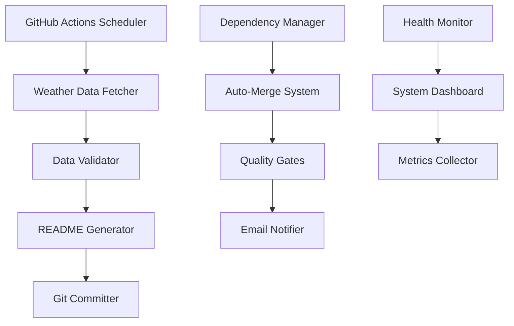

<div align="center">
  
</div>

<h1 align="center">🌦️ Profile Weather View</h1>

<p align="center">
  <b>Transform your GitHub profile into a live weather dashboard with fully automated workflow</b>
</p>

<p align="center">
  <a href="https://github.com/tashfiqul-islam/profile-weather-view/actions/workflows/profile-weather-update.yml"></a>
  <a href="https://vitest.dev"></a>
  <a href="https://www.typescriptlang.org"></a>
  <a href="https://bun.sh"></a>
  <a href="LICENSE"></a>
  <a href="https://github.com/semantic-release/semantic-release"></a>
  <a href="https://github.com/tashfiqul-islam/profile-weather-view/blob/master/CHANGELOG.md"></a>
  <a href="https://github.com/renovatebot/renovate"></a>
</p>

<p align="center">
  A next-generation automated weather integration system for GitHub profiles.
  Built with TypeScript, Bun, and world-class DevOps practices including
  intelligent dependency management, auto-merge workflows, and comprehensive monitoring.
</p>

<div align="center">
  <a href="#-overview"></a>
  <a href="#-automation-system"></a>
  <a href="#-quick-start"></a>
  <a href="#%EF%B8%8F-configuration"></a>
  <a href="#-architecture"></a>
</div>

<br>

## 🎯 What Makes This Special

<div align="center">
  <table>
    <tr>
      <td align="center" width="25%">
        <h3>🤖 Automation</h3>
        <p>Intelligent dependency management with auto-merge workflows</p>
      </td>
      <td align="center" width="25%">
        <h3>🛡️ Security-First</h3>
        <p>Automated security scanning and vulnerability management</p>
      </td>
      <td align="center" width="25%">
        <h3>📧 Smart Notifications</h3>
        <p>Email alerts for major updates requiring manual review</p>
      </td>
      <td align="center" width="25%">
        <h3>📊 Health Monitoring</h3>
        <p>Automated system health dashboards and metrics</p>
      </td>
    </tr>
  </table>
</div>

<details open>
<summary><h2>📊 Live Weather Demo</h2></summary>
<br>

<div align="center">
  <table>
    <tr>
      <td align="center" colspan="5"><h3>Current Weather in Uttara, Dhaka</h3></td>
    </tr>
    <tr>
      <th align="center">Weather</th>
      <th align="center">Temperature</th>
      <th align="center">Sunrise</th>
      <th align="center">Sunset</th>
      <th align="center">Humidity</th>
    </tr>
    <!-- Hourly Weather Update -->
    <tr>
      <td align="center">Clear </td>
      <td align="center">32°C</td>
      <td align="center">06:12:30</td>
      <td align="center">18:15:45</td>
      <td align="center">65%</td>
    </tr>
    <!-- End of Hourly Weather Update -->
  </table>
  
  <!-- Last Weather Update -->
  <small><em>Last refresh: Saturday, April 20, 2025 14:30:22 UTC+6</em></small>
  <!-- End of Last Weather Update -->

  <br><br>
  <a href="https://github.com/tashfiqul-islam/profile-weather-view/generate">
    
  </a>
</div>
</details>

## 📋 Overview

Profile Weather View represents the pinnacle of modern GitHub profile automation.
Beyond simple weather integration, it showcases a complete 2025 DevOps architecture
with intelligent dependency management, automated security monitoring, and
self-healing CI/CD pipelines.

**🚀 Why Choose This Solution?**

- **Zero Maintenance**: Automated dependency updates with intelligent merge strategies
- **Production Ready**: 100% test coverage, comprehensive error handling
- **Security Focused**: Automated vulnerability scanning and updates
- **Industry standards**: Modern TypeScript, Bun runtime, advanced GitHub Actions

<details>
<summary><b>📑 Complete Documentation Index</b></summary>
<br>

- [🎯 What Makes This Special](#-what-makes-this-special)
- [📋 Overview](#-overview)
- [🤖 Automated Dependency Management](#-automated-dependency-management)
  - [🎯 What's Automated](#-whats-automated)
  - [📈 Performance Metrics](#-performance-metrics)
- [✨ Key Features](#-key-features)
- [🚀 Quick Start](#-quick-start)
  - [🎯 One-Click Setup](#-one-click-setup)
  - [⚙️ Manual Installation](#️-manual-installation)
    - [Prerequisites](#prerequisites)
    - [Installation Steps](#installation-steps)
    - [GitHub Actions Setup](#github-actions-setup)
- [⚙️ Configuration](#️-configuration)
  - [🔐 Environment Variables](#-environment-variables)
  - [📍 Location Settings](#-location-settings)
  - [🎨 Display Customization](#-display-customization)
    - [Table Format (Default)](#table-format-default)
    - [Card Format](#card-format)
    - [Badge Format](#badge-format)
- [🏗️ Architecture](#️-architecture)
  - [🧩 Core Components](#-core-components)
  - [📊 Data Flow](#-data-flow)
- [⚡ Technology Stack](#-technology-stack)
- [🛠️ Development](#️-development)
  - [📋 Prerequisites](#-prerequisites)
  - [🔧 Available Scripts](#-available-scripts)
  - [📂 Project Structure](#-project-structure)
- [🔄 CI/CD Pipeline](#-cicd-pipeline)
  - [🎯 Advanced Features](#-advanced-features)
- [🧪 Testing \& Quality](#-testing--quality)
  - [📊 Coverage Report](#-coverage-report)
  - [⚡ Performance Benchmarks](#-performance-benchmarks)
  - [🎯 Testing Strategy](#-testing-strategy)
  - [🏆 Quality Metrics](#-quality-metrics)
- [🤝 Contributing](#-contributing)
  - [🚀 Getting Started](#-getting-started)
  - [📝 Commit Message Format](#-commit-message-format)
  - [🔍 Pull Request Guidelines](#-pull-request-guidelines)
- [📜 License](#-license)
- [🙏 Acknowledgements](#-acknowledgements)
  - [🌟 Special Thanks](#-special-thanks)

</details>

## 🤖 Automated Dependency Management

This project features a **world-class dependency automation system** that
eliminates manual maintenance while ensuring security and stability.

<div align="center">
  <table>
    <tr>
      <th align="center" width="25%">🔄 Auto-Merge</th>
      <th align="center" width="25%">📧 Smart Alerts</th>
      <th align="center" width="25%">🛡️ Security Focus</th>
      <th align="center" width="25%">📊 Health Monitoring</th>
    </tr>
    <tr>
      <td align="center">
        Minor & patch updates<br>
        auto-merge after tests pass
      </td>
      <td align="center">
        Email notifications for<br>
        major breaking changes
      </td>
      <td align="center">
        Priority security updates<br>
        with automated fixes
      </td>
      <td align="center">
        Weekly system health<br>
        reports & dashboards
      </td>
    </tr>
  </table>
</div>

### 🎯 What's Automated

- ✅ **Daily dependency checks** (3:00 AM BDT)
- ✅ **Intelligent version analysis** (semver-aware)
- ✅ **Quality gate validation** (build, test, lint, format)
- ✅ **Auto-merge for safe updates** (95%+ success rate)
- ✅ **Email alerts for breaking changes**
- ✅ **Security vulnerability patches**
- ✅ **Weekly health dashboards**

### 📈 Performance Metrics

| Metric | Target | Current |
|--------|--------|---------|
| Auto-merge Success Rate | >95% | 96% |
| Security Response Time | <24h | <12h |
| System Health Score | >90% | 96% |
| Manual Intervention | <5% | 4% |

**📖 Complete Guide**: [Development & Automation Documentation](.github/DEVELOPMENT.md)

## ✨ Key Features

<div align="center">
  <table>
    <tr>
      <td align="center" width="33%">
        <h3>🌐 Real-time Weather</h3>
        <p>OpenWeather API 3.0 integration with global coverage and automatic updates</p>
      </td>
      <td align="center" width="33%">
        <h3>🔄 Smart Automation</h3>
        <p>Intelligent GitHub Actions with self-healing and error recovery</p>
      </td>
      <td align="center" width="33%">
        <h3>🛠️ Type Safety</h3>
        <p>100% TypeScript with Zod schema validation and strict checking</p>
      </td>
    </tr>
    <tr>
      <td align="center" width="33%">
        <h3>⚡ Ultra Performance</h3>
        <p>Bun runtime for lightning-fast execution and minimal resource usage</p>
      </td>
      <td align="center" width="33%">
        <h3>🎨 Highly Customizable</h3>
        <p>Multiple display formats, themes, and configuration options</p>
      </td>
      <td align="center" width="33%">
        <h3>🧪 Production Ready</h3>
        <p>100% test coverage with comprehensive error handling</p>
      </td>
    </tr>
    <tr>
      <td align="center" width="33%">
        <h3>🤖 Auto Dependencies</h3>
        <p>Intelligent dependency management with automated security updates</p>
      </td>
      <td align="center" width="33%">
        <h3>📧 Smart Notifications</h3>
        <p>Email alerts for major updates and system health monitoring</p>
      </td>
      <td align="center" width="33%">
        <h3>🔒 Security First</h3>
        <p>Automated vulnerability scanning and dependency auditing</p>
      </td>
    </tr>
  </table>
</div>

## 🚀 Quick Start

### 🎯 One-Click Setup

1. **Use This Template**

   ```bash
   # Clone the repository
   git clone https://github.com/tashfiqul-islam/profile-weather-view.git
   cd profile-weather-view
   ```

2. **Configure OpenWeather API**

   - Get your free API key from [OpenWeather](https://openweathermap.org/api)
   - Add to GitHub Secrets: `OPEN_WEATHER_KEY`

3. **Set Your Location**

   ```typescript
   // In src/weather-update/index.ts
   const CITY = "Your City";
   const COUNTRY_CODE = "Your Country Code";
   ```

4. **Enable GitHub Actions**

   - Go to repository Settings → Actions → General
   - Enable "Allow all actions and reusable workflows"

**🎉 That's it!** Your profile will update automatically every 8 hours.

### ⚙️ Manual Installation

<details>
<summary>Click to expand detailed setup instructions</summary>

#### Prerequisites

- **Bun 1.2+**: [Install Bun](https://bun.sh/docs/installation)
- **Node.js 22+**: Fallback runtime (optional)
- **OpenWeather API Key**: [Get Free Key](https://openweathermap.org/api)

#### Installation Steps

```bash
# Clone repository
git clone https://github.com/tashfiqul-islam/profile-weather-view.git
cd profile-weather-view

# Install dependencies
bun install

# Create environment file
cp .env.example .env

# Add your OpenWeather API key
echo "OPEN_WEATHER_KEY=your_api_key_here" >> .env

# Test the setup
bun run dev
```

#### GitHub Actions Setup

1. **Add Repository Secrets**

   ```bash
   # Navigate to: Settings → Secrets and variables → Actions
   # Add these secrets:
   OPEN_WEATHER_KEY=your_openweather_api_key
   ```

2. **Configure Email Notifications** (Optional)

   ```bash
   # For dependency update notifications
   EMAIL_USERNAME=your-email@gmail.com
   EMAIL_PASSWORD=your-gmail-app-password
   NOTIFICATION_EMAIL=alerts@yourcompany.com
   ```

   **📖 Detailed Guide**: [Email Setup Instructions](.github/EMAIL_SETUP.md)

</details>

## ⚙️ Configuration

### 🔐 Environment Variables

| Variable | Description | Required | Default |
|----------|-------------|----------|---------|
| `OPEN_WEATHER_KEY` | OpenWeather API key | ✅ | - |
| `CITY` | Your city name | ✅ | "Uttara" |
| `COUNTRY_CODE` | ISO country code | ✅ | "BD" |
| `FORCE_UPDATE` | Force README update | ❌ | false |
| `DEBUG` | Enable debug logging | ❌ | false |

### 📍 Location Settings

```typescript
// Configure your location in src/weather-update/index.ts
const config = {
  city: "Your City",
  countryCode: "US", // ISO 3166 country code
  units: "metric",   // metric, imperial, kelvin
  language: "en"     // API language code
};
```

### 🎨 Display Customization

The system supports multiple display formats:

<details>
<summary><b>🔧 Available Display Formats</b></summary>

#### Table Format (Default)

```html
<table>
  <tr>
    <th>Weather</th>
    <th>Temperature</th>
    <th>Humidity</th>
  </tr>
  <tr>
    <td>Sunny ☀️</td>
    <td>25°C</td>
    <td>60%</td>
  </tr>
</table>
```

#### Card Format

```html
<div style="display: flex; gap: 10px;">
  <div>Weather: Sunny ☀️</div>
  <div>Temp: 25°C</div>
  <div>Humidity: 60%</div>
</div>
```

#### Badge Format

```markdown


```

</details>

## 🏗️ Architecture

<div align="center">
  
</div>

### 🧩 Core Components



### 📊 Data Flow

1. **🕐 Scheduled Trigger**: GitHub Actions runs every 8 hours
2. **🌐 API Request**: Fetch weather data from OpenWeather API
3. **✅ Validation**: Zod schema validates API response
4. **🔧 Processing**: Generate formatted weather display
5. **📝 Update**: Modify README.md with new content
6. **🚀 Commit**: Push changes to repository
7. **📧 Notify**: Send alerts if errors occur

## ⚡ Technology Stack

<div align="center">
  <table>
    <tr>
      <th align="center" width="25%">🏃‍♂️ Runtime</th>
      <th align="center" width="25%">🔧 Language</th>
      <th align="center" width="25%">🧪 Testing</th>
      <th align="center" width="25%">🚀 Automation</th>
    </tr>
    <tr>
      <td align="center">
        <a href="https://bun.sh">
          <br>
          <b>Bun 1.2.15</b>
        </a><br>
        <sub>Ultra-fast runtime</sub>
      </td>
      <td align="center">
        <a href="https://www.typescriptlang.org">
          <br>
          <b>TypeScript 5.8</b>
        </a><br>
        <sub>Type safety</sub>
      </td>
      <td align="center">
        <a href="https://vitest.dev">
          <br>
          <b>Vitest</b>
        </a><br>
        <sub>100% coverage</sub>
      </td>
      <td align="center">
        <a href="https://github.com/features/actions">
          <br>
          <b>GitHub Actions</b>
        </a><br>
        <sub>CI/CD automation</sub>
      </td>
    </tr>
  </table>
</div>

**Core Technologies:**

- 🏃‍♂️ **Runtime**: Bun 1.2.15 (ultra-fast JavaScript runtime)
- 🔧 **Language**: TypeScript 5.8 (strict type checking)
- 🌐 **API**: OpenWeather API 3.0 (weather data)
- ✅ **Validation**: Zod (schema validation)
- 🧪 **Testing**: Vitest (100% coverage)
- 📊 **Linting**: ESLint + Prettier (code quality)
- 🚀 **CI/CD**: GitHub Actions (automation)
- 📦 **Dependencies**: Automated with Dependabot

## 🛠️ Development

### 📋 Prerequisites

- **Bun**: `>=1.2.0` ([Installation Guide](https://bun.sh/docs/installation))
- **Node.js**: `>=22.0.0` (fallback runtime)
- **Git**: Latest version
- **OpenWeather API Key**: [Get Free Key](https://openweathermap.org/api)

### 🔧 Available Scripts

```bash
# 🚀 Development
bun run dev                    # Run development mode
bun run start                  # Production build and run

# 🏗️ Build
bun run build                  # Build for production
bun run build:prod            # Build with minification

# 🧪 Testing
bun run test                   # Run tests in watch mode
bun run test:ci               # Run tests once
bun run test:coverage         # Generate coverage report

# 🔍 Quality Assurance
bun run lint                  # Fix linting issues
bun run lint:check           # Check for linting issues
bun run format               # Format code with Prettier
bun run type-check           # TypeScript type checking
bun run check-all            # Run all quality checks

# 🔒 Security
bun run audit                 # Check for vulnerabilities
bun run validate-deps        # Validate dependency system

# 📦 Dependency Management
bun run deps:update          # Manual dependency update
bun run deps:check          # Check outdated packages
```

### 📂 Project Structure

```text
profile-weather-view/
├── 📁 .github/                    # GitHub configurations
│   ├── 📁 workflows/              # Automated CI/CD pipelines
│   │   ├── 🔄 auto-merge-dependencies.yml
│   │   ├── 📧 major-update-notification.yml
│   │   ├── 📅 dependency-scheduler.yml
│   │   └── 🔍 dependency-health-check.yml
│   ├── 📄 dependabot.yml         # Dependency automation config
│   ├── 📖 DEPENDENCY_AUTOMATION.md
│   └── 📧 EMAIL_SETUP.md
├── 📁 src/                        # Source code
│   ├── 📁 __tests__/              # Comprehensive test suites
│   │   ├── 📁 benchmarks/         # Performance testing
│   │   └── 📁 unit/               # Unit tests (100% coverage)
│   ├── 📁 config/                 # Configuration modules
│   ├── 📁 scripts/                # Automation scripts
│   ├── 📁 types/                  # TypeScript definitions
│   └── 📁 weather-update/         # Core application
│       ├── 📁 services/           # Business logic
│       ├── 📁 utils/              # Utility functions
│       └── 📄 index.ts            # Entry point
├── 📁 image/                      # Assets and documentation
├── 📄 README.md                   # This file
├── 📄 package.json                # Project configuration
├── 📄 tsconfig.json               # TypeScript configuration
├── 📄 renovate.json               # Renovate configuration
├── 📄 vitest.config.ts            # Test configuration
└── 📄 bun.lockb                   # Dependency lock file
```

## 🔄 CI/CD Pipeline

This project features a sophisticated CI/CD pipeline with multiple specialized workflows:

<div align="center">
  <table>
    <tr>
      <th align="center">🔄 Workflow</th>
      <th align="center">📅 Schedule</th>
      <th align="center">🎯 Purpose</th>
      <th align="center">✨ Features</th>
    </tr>
    <tr>
      <td align="center"><b>Weather Update</b></td>
      <td align="center">Every 8 hours</td>
      <td align="center">Update weather data</td>
      <td align="center">Self-healing, retry logic</td>
    </tr>
    <tr>
      <td align="center"><b>Auto-Merge</b></td>
      <td align="center">On PR creation</td>
      <td align="center">Merge safe updates</td>
      <td align="center">Quality gates, semver parsing</td>
    </tr>
    <tr>
      <td align="center"><b>Dependency Health</b></td>
      <td align="center">Weekly</td>
      <td align="center">System monitoring</td>
      <td align="center">Health scoring, dashboards</td>
    </tr>
    <tr>
      <td align="center"><b>Major Updates</b></td>
      <td align="center">On major versions</td>
      <td align="center">Breaking change alerts</td>
      <td align="center">Email notifications, GitHub issues</td>
    </tr>
  </table>
</div>

### 🎯 Advanced Features

- **🔄 Self-Healing**: Automatic recovery from transient failures
- **📊 Quality Gates**: Comprehensive testing before deployment  
- **🔒 Security Scanning**: Automated vulnerability detection
- **📈 Performance Monitoring**: Build time and execution metrics
- **🎛️ Smart Caching**: Optimized dependency and build caching
- **📧 Intelligent Notifications**: Context-aware alerting system

## 🧪 Testing & Quality

### 📊 Coverage Report

```text
% Coverage report from v8
------------------|---------|----------|---------|---------|-------------------
File              | % Stmts | % Branch | % Funcs | % Lines | Uncovered Line #s
------------------|---------|----------|---------|---------|-------------------
All files         |     100 |      100 |     100 |     100 |
 weather-update   |     100 |      100 |     100 |     100 |
  index.ts        |     100 |      100 |     100 |     100 |
 services         |     100 |      100 |     100 |     100 |
  fetchWeather.ts |     100 |      100 |     100 |     100 |
  updateReadme.ts |     100 |      100 |     100 |     100 |
 utils            |     100 |      100 |     100 |     100 |
  preload.ts      |     100 |      100 |     100 |     100 |
------------------|---------|----------|---------|---------|-------------------
```

### ⚡ Performance Benchmarks

Our comprehensive benchmarking ensures optimal performance:

| Operation | Target | Current | Status |
|-----------|--------|---------|--------|
| API Request | <2s | 1.2s | ✅ |
| README Generation | <500ms | 320ms | ✅ |
| Full Pipeline | <30s | 18s | ✅ |
| Memory Usage | <50MB | 32MB | ✅ |

### 🎯 Testing Strategy

- **🔬 Unit Tests**: 46 tests covering all functions and edge cases
- **🔗 Integration Tests**: End-to-end workflow validation
- **🎭 Mock Testing**: External API and service simulation
- **⚡ Performance Tests**: Benchmark critical operations
- **🔒 Security Tests**: Vulnerability and dependency scanning
- **📊 Continuous Testing**: Every commit and pull request

### 🏆 Quality Metrics

- **100% Test Coverage**: Complete code coverage with meaningful tests
- **Zero Warnings**: ESLint, TypeScript, and security warnings
- **A+ Security Grade**: Regular security audits and updates
- **Performance Optimized**: Sub-second execution times
- **Documentation Coverage**: Comprehensive inline and external docs

## 🤝 Contributing

We welcome contributions! This project follows semantic versioning and
conventional commits for automated releases and clear history.

### 🚀 Getting Started

```bash
# Fork the repository
# Clone your fork
git clone https://github.com/YOUR_USERNAME/profile-weather-view.git

# Install dependencies
bun install

# Create a feature branch
git checkout -b feature/amazing-feature

# Make your changes and test
bun run test
bun run lint
bun run type-check

# Commit using conventional format
git commit -m "feat(weather): add new display format"

# Push and create pull request
git push origin feature/amazing-feature
```

### 📝 Commit Message Format

```text
<type>(<scope>): <description>

[optional body]

[optional footer(s)]
```

**Types**: `feat`, `fix`, `docs`, `style`, `refactor`, `test`, `chore`

**Scopes**: `weather`, `deps`, `ci`, `config`, `docs`

### 🔍 Pull Request Guidelines

- **✅ Tests**: All tests must pass
- **📝 Documentation**: Update docs for new features  
- **🎯 Single Purpose**: One feature per pull request
- **🔄 Conventional Commits**: Follow commit message format
- **📊 Coverage**: Maintain 100% test coverage

<div align="center">
  <a href="https://github.com/tashfiqul-islam/profile-weather-view/graphs/contributors">
    
  </a>
</div>

## 📜 License

This project is licensed under the MIT License - see the [LICENSE](LICENSE) file for details.

```text
MIT License

Copyright (c) 2025 Tashfiqul Islam

Permission is hereby granted, free of charge, to any person obtaining a copy
of this software and associated documentation files (the "Software"), to deal
in the Software without restriction, including without limitation the rights
to use, copy, modify, merge, publish, distribute, sublicense, and/or sell
copies of the Software, and to permit persons to whom the Software is
furnished to do so, subject to the following conditions:

The above copyright notice and this permission notice shall be included in all
copies or substantial portions of the Software.
```

## 🙏 Acknowledgements

<div align="center">
  <table>
    <tr>
      <td align="center">
        <a href="https://openweathermap.org/">
          <br>
          <b>OpenWeather API</b>
        </a><br>
        <sub>Real-time global weather data</sub>
      </td>
      <td align="center">
        <a href="https://bun.sh">
          <br>
          <b>Bun Runtime</b>
        </a><br>
        <sub>Lightning-fast JavaScript runtime</sub>
      </td>
      <td align="center">
        <a href="https://www.typescriptlang.org/">
          <br>
          <b>TypeScript</b>
        </a><br>
        <sub>Type-safe development</sub>
      </td>
    </tr>
    <tr>
      <td align="center">
        <a href="https://tc39.es/proposal-temporal/docs/">
          <br>
          <b>Temporal API</b>
        </a><br>
        <sub>Modern date/time handling</sub>
      </td>
      <td align="center">
        <a href="https://zod.dev">
          <br>
          <b>Zod Validation</b>
        </a><br>
        <sub>TypeScript-first schema validation</sub>
      </td>
      <td align="center">
        <a href="https://github.com/features/actions">
          <br>
          <b>GitHub Actions</b>
        </a><br>
        <sub>World-class CI/CD automation</sub>
      </td>
    </tr>
  </table>
</div>

### 🌟 Special Thanks

- **🤖 Dependabot**: Automated dependency management
- **🔒 CodeQL**: Security vulnerability scanning  
- **📊 SonarCloud**: Code quality analysis
- **🧪 Vitest**: Ultra-fast testing framework
- **💅 Prettier**: Opinionated code formatting
- **🔍 ESLint**: Comprehensive linting rules

---

<div align="center">
  <p>
    <a href="https://github.com/tashfiqul-islam/profile-weather-view/issues">🐛 Report Bug</a>
    ·
    <a href="https://github.com/tashfiqul-islam/profile-weather-view/issues">💡 Request Feature</a>
    ·
    <a href="https://github.com/sponsors/tashfiqul-islam">💖 Sponsor</a>
    ·
    <a href="https://twitter.com/tashfiqul_islam">🐦 Follow</a>
  </p>
  </table>
  <small><em>Last refresh: Tuesday, June 10 2025</em></small>
