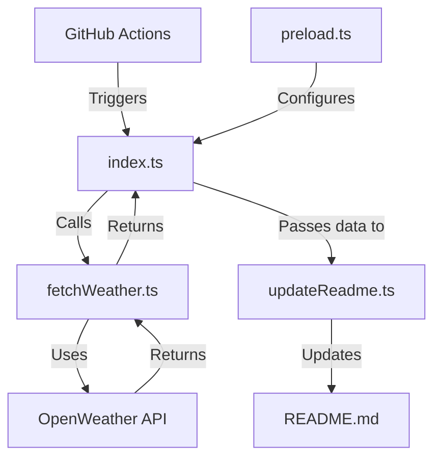

# 🌦️ Profile Weather View

<div align="center">

[](https://github.com/tashfiqul-islam/profile-weather-view/actions/workflows/update-readme.yml)
[](https://github.com/tashfiqul-islam/profile-weather-view/stargazers)
[](https://github.com/tashfiqul-islam/profile-weather-view/network/members)
[](https://github.com/tashfiqul-islam/profile-weather-view/issues)
[](https://vitest.dev)
[](LICENSE)
[](https://www.typescriptlang.org)
[](https://bun.sh)
[](https://tc39.es/proposal-temporal/docs/)
[](CONTRIBUTING.md)

<br>

<div align="center">

```
⭐ Transform your GitHub profile into a live weather dashboard ⭐
```

<p align="center">
  <b>Profile Weather View</b> seamlessly integrates real-time weather data into your GitHub profile README using the OpenWeather API and GitHub Actions automation. Built with TypeScript and Bun, it delivers accurate weather information for any location with sunrise, sunset, temperature, and humidity metrics that automatically update every 8 hours.
</p>

<p align="center">
  <i>Set it up once and enjoy dynamic weather updates forever—no maintenance required.</i>
</p>

</div>

<br>

<details>
<summary>📊 Example Weather Display</summary>
<br>

<div align="center">

### Current Weather in Uttara, Dhaka

|                                   Weather                                    | Temperature | Sunrise  |  Sunset  | Humidity |
|:----------------------------------------------------------------------------:|:-----------:|:--------:|:--------:|:--------:|
| Clear  |    32°C     | 06:12:30 | 18:15:45 |   65%    |

<div align="center">
  <h6>
    <em>Last refresh: Friday, March 08, 2025 14:30:22 UTC+6</em>
  </h6>
</div>

</div>
</details>

<a href="https://github.com/tashfiqul-islam/profile-weather-view/generate">
  
</a>

</div>

<hr>

## 📋 Overview

Profile Weather View dynamically updates your GitHub profile README with real-time weather data for your location. Built with TypeScript and modern web technologies, it leverages GitHub Actions for fully automated updates every 6 hours.

<details open>
<summary><b>📚 Table of Contents</b></summary>

- [📋 Overview](#-overview)
- [✨ Key Features](#-key-features)
- [🚀 Quick Start](#-quick-start)
- [🧩 Architecture](#-architecture)
- [🏗️ Core Components](#core-components)
- [📚 Documentation](#-documentation)
- [⚡ Technology Stack](#-technology-stack)
- [🔄 CI/CD Pipeline](#cicd-pipeline)
- [⚙️ Configuration](#-configuration)
- [🛠️ Development](#-development)
- [🧪 Testing](#-testing)
- [🤝 Contributing](#-contributing)
- [📜 License](#-license)
- [🙏 Acknowledgements](#-acknowledgements)

</details>

## ✨ Key Features

<div align="center">
<table>
  <tr>
    <td align="center">
      <h3>🌐</h3>
      <b>Real-time Data</b><br>
      <small>OpenWeather API 3.0</small>
    </td>
    <td align="center">
      <h3>🔄</h3>
      <b>Auto-Updates</b><br>
      <small>Every 8 hours via Actions</small>
    </td>
    <td align="center">
      <h3>🛠️</h3>
      <b>Type Safety</b><br>
      <small>100% TypeScript + Zod</small>
    </td>
  </tr>
  <tr>
    <td align="center">
      <h3>⚡</h3>
      <b>High Performance</b><br>
      <small>Bun runtime optimization</small>
    </td>
    <td align="center">
      <h3>🕒</h3>
      <b>Smart Time Handling</b><br>
      <small>Temporal API integration</small>
    </td>
    <td align="center">
      <h3>🧪</h3>
      <b>Reliability</b><br>
      <small>100% test coverage</small>
    </td>
  </tr>
</table>
</div>

## 🚀 Quick Start

### One-Minute Setup

```bash
# Clone, install, and set up in one command
npx degit tashfiqul-islam/profile-weather-view my-weather-profile && \
cd my-weather-profile && \
bun install && \
echo "OPEN_WEATHER_KEY=your_api_key_here" > .env
```

### Manual Installation

1. **Clone the repository**
   ```bash
   git clone https://github.com/tashfiqul-islam/profile-weather-view.git
   cd profile-weather-view
   ```

2. **Install dependencies**
   ```bash
   bun install
   ```

3. **Configure environment**
   ```bash
   echo "OPEN_WEATHER_KEY=your_api_key_here" > .env
   ```

4. **Run locally**
   ```bash
   bun start
   ```

5. **Setup GitHub Actions**
    - Fork this repository
    - Add your OpenWeather API key as a GitHub secret named `OPEN_WEATHER_KEY`
    - The workflow will automatically run every 8 hours

## 🧩 Architecture

Profile Weather View follows a clean, modular architecture designed for maintainability and extensibility.



## 🏗️ Project Details

Profile Weather View follows a modular design with four core components working together to deliver real-time weather data to your GitHub profile.

<div align="center">
  
</div>

### Core Components

Profile Weather View is built around four specialized modules, each with a distinct responsibility:

| Component             | Purpose                                                                         |
|-----------------------|---------------------------------------------------------------------------------|
| **`index.ts`**        | Application entry point and orchestrator that manages the flow between services |
| **`fetchWeather.ts`** | Weather service that retrieves and validates data from the OpenWeather API      |
| **`updateReadme.ts`** | Service that updates the README with new weather data                           |
| **`preload.ts`**      | Environment validator that ensures required configuration is present            |

### Data Flow

The application follows a unidirectional data flow:

1. **Initialization** — Load and validate environment variables
2. **Data Acquisition** — Fetch and validate weather data from OpenWeather API
3. **Display** — Update README with formatted weather information
4. **Completion** — Report success or provide troubleshooting details

## 📚 Documentation

Comprehensive documentation for the Profile Weather View project is available in the [`src/docs/`](./src/docs/) directory. This includes detailed information on:

<div align="center">
  <table>
    <tr>
      <td align="center"><a href="./src/docs/getting-started.md">🚀 Getting Started</a></td>
      <td align="center"><a href="./src/docs/architecture.md">🏗️ Architecture</a></td>
      <td align="center"><a href="./src/docs/api-reference.md">📋 API Reference</a></td>
      <td align="center"><a href="./src/docs/configuration.md">⚙️ Configuration</a></td>
    </tr>
    <tr>
      <td align="center"><a href="./src/docs/deployment.md">🚢 Deployment</a></td>
      <td align="center"><a href="./src/docs/testing.md">🧪 Testing</a></td>
      <td align="center"><a href="./src/docs/contributing.md">👥 Contributing</a></td>
      <td align="center"><a href="./src/docs/troubleshooting.md">🔧 Troubleshooting</a></td>
    </tr>
  </table>
</div>

<div align="center">
  <a href="./src/docs/README.md">
    
  </a>
</div>

For comprehensive details on all aspects of the project, please refer to the [Documentation Home](./src/docs/README.md).

## ⚡ Technology Stack

<div align="center">

[](https://bun.sh)
[](https://www.typescriptlang.org/)
[](https://openweathermap.org/api)
[](https://tc39.es/proposal-temporal/docs/)
[](https://zod.dev)
[](https://github.com/features/actions)
[](https://nodejs.org/api/)
[](https://eslint.org/)

</div>

## CI/CD Pipeline

The application uses GitHub Actions for automated deployment with the following key features:

<div align="center">
  <table>
    <tr>
      <th align="center">Feature</th>
      <th align="center">Benefit</th>
    </tr>
    <tr>
      <td align="center"><b>Two-Job Structure</b></td>
      <td align="center">Early failure detection with preflight checks</td>
    </tr>
    <tr>
      <td align="center"><b>Scheduled Updates</b></td>
      <td align="center">Automatic refresh every 6 hours</td>
    </tr>
    <tr>
      <td align="center"><b>Manual Triggering</b></td>
      <td align="center">Run on-demand with custom parameters</td>
    </tr>
    <tr>
      <td align="center"><b>Dependency Caching</b></td>
      <td align="center">Faster builds with reduced network usage</td>
    </tr>
    <tr>
      <td align="center"><b>Retry Logic</b></td>
      <td align="center">Resilience against temporary API failures</td>
    </tr>
  </table>
</div>

### Required Secrets

You'll need to add one secret to your GitHub repository:

- `OPEN_WEATHER_KEY`: Your OpenWeather API key

### Basic Configuration

```yaml
# Schedule: Every 6 hours at minute 17
cron: '17 */6 * * *'

# Manual inputs available:
inputs:
  location:      # Weather location to display
  force_update:  # Force update even if no changes
  debug:         # Enable verbose logging
```

For detailed information about the deployment process, configuration options, and troubleshooting, please refer to the [full deployment documentation](src/docs/deployment.md).

## ⚙️ Configuration

Profile Weather View is highly configurable to meet your specific needs.

### Environment Variables

| Variable           | Description             | Example         |
|--------------------|-------------------------|-----------------|
| `OPEN_WEATHER_KEY` | API key for OpenWeather | `a1b2c3d4e5...` |

### Location Settings (in fetchWeather.ts)

| Setting    | Description          | Default                   |
|------------|----------------------|---------------------------|
| `LAT`      | Latitude coordinate  | `23.8759` (Uttara, Dhaka) |
| `LON`      | Longitude coordinate | `90.3795` (Uttara, Dhaka) |
| `TIMEZONE` | Local timezone       | `Asia/Dhaka`              |

### Bun Configuration (bunfig.toml)

```toml
# Key Bun configuration settings
preload = ["./src/utils/preload.ts"]
smol = false  # Optimized for performance
logLevel = "warn"

[run]
bun = true

[loader]
".ts" = "ts"
```

## 🛠️ Development

### Prerequisites

- [Bun](https://bun.sh) >= 1.0.0
- [OpenWeather API Key](https://openweathermap.org/api)
- [GitHub Account](https://github.com)

### Common Commands

```bash
# Start the application
bun start

# Run tests
bun test

# Check types
bun run typecheck

# Format code
bun run format
```

### Project Structure

```
src/
├── index.ts               # Entry point
├── services/              # Core services
│   ├── fetchWeather.ts    # Weather API integration
│   └── updateReadme.ts    # README modification
└── utils/                 # Utility functions
    └── preload.ts         # Environment setup
```

## 🧪 Testing

The project has comprehensive test coverage to ensure reliability:

```
% Coverage report from v8
------------------|---------|----------|---------|---------|-------------------
File              | % Stmts | % Branch | % Funcs | % Lines | Uncovered Line #s
------------------|---------|----------|---------|---------|-------------------
All files         |     100 |      100 |     100 |     100 |                  
 src              |     100 |      100 |     100 |     100 |                  
  index.ts        |     100 |      100 |     100 |     100 |                  
 src/services     |     100 |      100 |     100 |     100 |                  
  fetchWeather.ts |     100 |      100 |     100 |     100 |                  
  updateReadme.ts |     100 |      100 |     100 |     100 |                  
 src/utils        |     100 |      100 |     100 |     100 |                  
  preload.ts      |     100 |      100 |     100 |     100 |                  
------------------|---------|----------|---------|---------|-------------------
```

### Testing Strategies

- **Unit Tests**: Each function is tested in isolation
- **Integration Tests**: Services are tested together
- **Mock Tests**: External API calls are mocked
- **Error Handling Tests**: Verify proper error handling

<details>
<summary><b>Completed Milestones</b></summary>
<br>

### Q1 2025
- ✅ Bun runtime integration
- ✅ TypeScript migration
- ✅ Temporal API implementation
- ✅ Optimized CI/CD pipeline
- ✅ 100% test coverage

</details>

## 🤝 Contributing

We welcome contributions from the community! Here's how you can help:

1. **Fork the repository**
2. **Create a feature branch**: `git checkout -b feature/amazing-feature`
3. **Make your changes**
4. **Run tests**: `bun test`
5. **Commit changes**: Use conventional commit format
6. **Push to your fork**: `git push origin feature/amazing-feature`
7. **Open a pull request**

<div align="center">
  <a href="./src/docs/contributing.md">
    
  </a>
</div>

For detailed contribution guidelines, including code style, commit standards, and development workflow, please refer to the [Contributing Documentation](./src/docs/contributing.md).

## 📜 License

This project is licensed under the MIT License - see the [LICENSE](LICENSE) file for details.

```
Copyright (c) 2025 Tashfiqul Islam
```

## 🙏 Acknowledgements

<div align="center">
  <table>
    <tr>
      <td align="center">
        <a href="https://openweathermap.org/">
          <br>
          <b>OpenWeather API</b>
        </a><br>
        <sub>Real-time weather data</sub>
      </td>
      <td align="center">
        <a href="https://bun.sh">
          <br>
          <b>Bun</b>
        </a><br>
        <sub>Blazing fast runtime</sub>
      </td>
      <td align="center">
        <a href="https://www.typescriptlang.org/">
          <br>
          <b>TypeScript</b>
        </a><br>
        <sub>Type safety</sub>
      </td>
    </tr>
    <tr>
      <td align="center">
        <a href="https://tc39.es/proposal-temporal/docs/">
          <br>
          <b>Temporal API</b>
        </a><br>
        <sub>Modern date/time handling</sub>
      </td>
      <td align="center">
        <a href="https://zod.dev">
          <br>
          <b>Zod</b>
        </a><br>
        <sub>Schema validation</sub>
      </td>
      <td align="center">
        <a href="https://github.com/features/actions">
          <br>
          <b>GitHub Actions</b>
        </a><br>
        <sub>CI/CD automation</sub>
      </td>
    </tr>
  </table>
</div>

---

<div align="center">
  <p>
    <a href="https://github.com/tashfiqul-islam/profile-weather-view/issues">Report Bug</a>
    ·
    <a href="https://github.com/tashfiqul-islam/profile-weather-view/issues">Request Feature</a>
    ·
    <a href="https://github.com/sponsors/tashfiqul-islam">Sponsor</a>
  </p>
  <p>
    <small>
      Made with ❤️ by <a href="https://github.com/tashfiqul-islam">Tashfiqul Islam</a>
    </small>
  </p>
</div>
