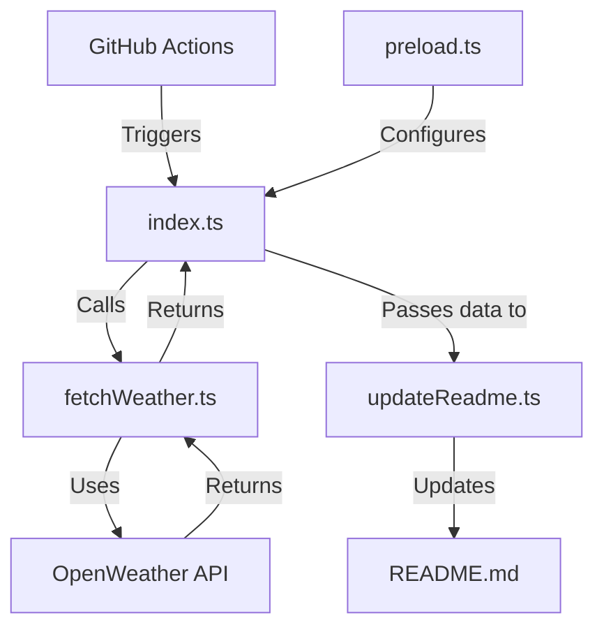

<div align="center">
  
</div>

<br>

<div align="center">

# 🌦️ Profile Weather View

<br>

[](https://github.com/tashfiqul-islam/profile-weather-view/actions/workflows/profile-weather-update.yml) [](https://vitest.dev) [](https://www.typescriptlang.org) [](https://bun.sh) [](LICENSE) [](CONTRIBUTING.md) [](https://tc39.es/proposal-temporal/docs/) [](https://zod.dev)

<br>

<p align="center">
  <b>Transform your GitHub profile into a live weather dashboard</b>
</p>

<p align="center">
  Profile Weather View integrates real-time weather data into your GitHub profile README using OpenWeather API and GitHub Actions automation. Built with TypeScript and Bun, it delivers accurate weather information that updates automatically every 8 hours.
</p>

<hr>

[📋 Overview](#-overview) • [✨ Features](#-key-features) • [🚀 Quick Start](#-quick-start) • [⚙️ Configuration](#️-configuration) • [🧩 Architecture](#-architecture) • [🛠️ Development](#️-development) • [📚 Documentation](#-documentation)

<hr>

</div>

<details>
<summary><b>📊 Example Weather Display</b></summary>
<br>

<div align="center">

### Current Weather in Uttara, Dhaka

|                                   Weather                                    | Temperature | Sunrise  |  Sunset  | Humidity |
|:----------------------------------------------------------------------------:|:-----------:|:--------:|:--------:|:--------:|
| Clear  |    32°C     | 06:12:30 | 18:15:45 |   65%    |

<div align="center">
  <h6>
    <em>Last refresh: Friday, March 29, 2025 14:30:22 UTC+6</em>
  </h6>
</div>

</div>

<a href="https://github.com/tashfiqul-islam/profile-weather-view/generate">
  
</a>

</div>
</details>

## 📋 Overview

Profile Weather View automatically updates your GitHub profile README with real-time weather data for your location. Built with TypeScript and modern web technologies, it leverages GitHub Actions for fully automated updates every 8 hours.

<details>
<summary><b>📚 Table of Contents</b></summary>

- [🌦️ Profile Weather View](#️-profile-weather-view)
    - [Current Weather in Uttara, Dhaka](#current-weather-in-uttara-dhaka)
  - [📋 Overview](#-overview)
  - [✨ Key Features](#-key-features)
  - [🚀 Quick Start](#-quick-start)
    - [One-Minute Setup](#one-minute-setup)
    - [Manual Installation](#manual-installation)
  - [⚙️ Configuration](#️-configuration)
    - [Environment Variables](#environment-variables)
    - [Location Settings](#location-settings)
    - [Display Customization](#display-customization)
  - [🧩 Architecture](#-architecture)
  - [🏗️ Core Components](#️-core-components)
    - [Data Flow](#data-flow)
  - [⚡ Technology Stack](#-technology-stack)
  - [🛠️ Development](#️-development)
    - [Prerequisites](#prerequisites)
    - [Available Scripts](#available-scripts)
    - [Project Structure](#project-structure)
  - [🔄 CI/CD Pipeline](#-cicd-pipeline)
  - [🧪 Testing](#-testing)
    - [Testing Strategy](#testing-strategy)
  - [📚 Documentation](#-documentation)
  - [🤝 Contributing](#-contributing)
  - [📜 License](#-license)
  - [🙏 Acknowledgements](#-acknowledgements)

</details>

## ✨ Key Features

<div align="center">
<table>
  <tr>
    <td align="center">
      <h3>🌐</h3>
      <b>Real-time Data</b><br>
      <small>OpenWeather API 3.0</small>
    </td>
    <td align="center">
      <h3>🔄</h3>
      <b>Auto-Updates</b><br>
      <small>Every 8 hours via Actions</small>
    </td>
    <td align="center">
      <h3>🛠️</h3>
      <b>Type Safety</b><br>
      <small>100% TypeScript + Zod</small>
    </td>
  </tr>
  <tr>
    <td align="center">
      <h3>⚡</h3>
      <b>High Performance</b><br>
      <small>Bun runtime optimization</small>
    </td>
    <td align="center">
      <h3>🕒</h3>
      <b>Smart Time Handling</b><br>
      <small>Temporal API integration</small>
    </td>
    <td align="center">
      <h3>🧪</h3>
      <b>Reliability</b><br>
      <small>100% test coverage</small>
    </td>
  </tr>
</table>
</div>

## 🚀 Quick Start

<div align="center">
  
</div>

### One-Minute Setup

```bash
# Clone and set up in one command
npx degit tashfiqul-islam/profile-weather-view my-weather-profile && \
cd my-weather-profile && \
bun install && \
echo "OPEN_WEATHER_KEY=your_api_key_here" > .env
```

### Manual Installation

1. **Clone the repository**

   ```bash
   git clone https://github.com/tashfiqul-islam/profile-weather-view.git
   cd profile-weather-view
   ```

2. **Install dependencies**

   ```bash
   bun install
   ```

3. **Configure environment**

   ```bash
   echo "OPEN_WEATHER_KEY=your_api_key_here" > .env
   ```

4. **Run locally**

   ```bash
   bun start
   ```

5. **Setup GitHub Actions**
    - Fork this repository
    - Add your OpenWeather API key as a repository secret named `OPEN_WEATHER_KEY`
    - The workflow will automatically run every 8 hours

## ⚙️ Configuration

Profile Weather View is highly configurable to meet your specific needs.

### Environment Variables

| Variable           | Description             | Required | Default         |
|--------------------|-------------------------|----------|-----------------|
| `OPEN_WEATHER_KEY` | API key for OpenWeather | Yes      | -               |
| `LOG_LEVEL`        | Logging verbosity       | No       | `"warn"`        |
| `FORCE_UPDATE`     | Force README update     | No       | `"false"`       |

### Location Settings

Edit these values in `src/weather-update/services/fetchWeather.ts`:

| Setting    | Description          | Default                   |
|------------|----------------------|---------------------------|
| `LAT`      | Latitude coordinate  | `23.8759` (Uttara, Dhaka) |
| `LON`      | Longitude coordinate | `90.3795` (Uttara, Dhaka) |
| `TIMEZONE` | Local timezone       | `Asia/Dhaka`              |

### Display Customization

You can customize the weather display by modifying the template in `updateReadme.ts`:

```typescript
// Change this template to customize your weather display
const weatherTemplate = `
### Current Weather in ${location}

|                                   Weather                                    | Temperature | Sunrise  |  Sunset  | Humidity |
|:----------------------------------------------------------------------------:|:-----------:|:--------:|:--------:|:--------:|
| ${condition}  |    ${temperature}     | ${sunrise} | ${sunset} |   ${humidity}    |

<div align="center">
  <h6>
    <em>Last refresh: ${formattedDate}</em>
  </h6>
</div>
`;
```

## 🧩 Architecture

Profile Weather View follows a clean, modular architecture designed for maintainability and extensibility.

<div align="center">
  
</div>



## 🏗️ Core Components

Profile Weather View is built around four specialized modules, each with a distinct responsibility:

| Component             | Purpose                                                                         |
|-----------------------|---------------------------------------------------------------------------------|
| **`index.ts`**        | Application entry point and orchestrator that manages the flow between services |
| **`fetchWeather.ts`** | Weather service that retrieves and validates data from the OpenWeather API      |
| **`updateReadme.ts`** | Service that updates the README with new weather data                           |
| **`preload.ts`**      | Environment validator that ensures required configuration is present            |

### Data Flow

1. **Initialization**: Load and validate environment variables
2. **Data Acquisition**: Fetch and validate weather data from OpenWeather API
3. **Display**: Update README with formatted weather information
4. **Completion**: Report success or provide troubleshooting details

## ⚡ Technology Stack

<div align="center">
  <a href="https://bun.sh"></a>
  &nbsp;&nbsp;
  <a href="https://www.typescriptlang.org/"></a>
  &nbsp;&nbsp;
  <a href="https://openweathermap.org/api"></a>
  &nbsp;&nbsp;
  <a href="https://zod.dev"></a>
  &nbsp;&nbsp;
  <a href="https://github.com/features/actions"></a>
</div>

<br>

<div align="center">

[](https://bun.sh) [](https://www.typescriptlang.org/) [](https://openweathermap.org/api) [](https://tc39.es/proposal-temporal/docs/) [](https://zod.dev) [](https://github.com/features/actions) [](https://vitest.dev) [](https://eslint.org/)

</div>

## 🛠️ Development

### Prerequisites

- [Bun](https://bun.sh) >= 1.0.0
- [OpenWeather API Key](https://openweathermap.org/api)
- [GitHub Account](https://github.com)

### Available Scripts

<div align="center">
  <table>
    <tr>
      <th align="center">Category</th>
      <th align="center">Command</th>
      <th align="center">Description</th>
    </tr>
    <tr>
      <td rowspan="2" align="center"><b>Development</b></td>
      <td><code>bun run dev</code></td>
      <td>Run app in development mode</td>
    </tr>
    <tr>
      <td><code>bun run start</code></td>
      <td>Build and run the app in one go</td>
    </tr>
    <tr>
      <td rowspan="2" align="center"><b>Build</b></td>
      <td><code>bun run build</code></td>
      <td>Compile project to ./dist</td>
    </tr>
    <tr>
      <td><code>bun run build:prod</code></td>
      <td>Compile with minification for production</td>
    </tr>
    <tr>
      <td rowspan="5" align="center"><b>Testing</b></td>
      <td><code>bun run test</code></td>
      <td>Run all tests using Vitest</td>
    </tr>
    <tr>
      <td><code>bun run test:ci</code></td>
      <td>Run tests once (for CI/CD)</td>
    </tr>
    <tr>
      <td><code>bun run test:watch</code></td>
      <td>Watch mode (re-run on file change)</td>
    </tr>
    <tr>
      <td><code>bun run test:coverage</code></td>
      <td>Generate coverage report (V8)</td>
    </tr>
    <tr>
      <td><code>bun run test:staged</code></td>
      <td>Test only staged test files (git diff-based)</td>
    </tr>
    <tr>
      <td rowspan="3" align="center"><b>Quality</b></td>
      <td><code>bun run lint</code></td>
      <td>Run ESLint with auto-fix</td>
    </tr>
    <tr>
      <td><code>bun run format</code></td>
      <td>Format codebase using Prettier</td>
    </tr>
    <tr>
      <td><code>bun run check-all</code></td>
      <td>Type-check + Lint + Format + Test (CI-safe)</td>
    </tr>
    <tr>
      <td rowspan="2" align="center"><b>Security</b></td>
      <td><code>bun run security</code></td>
      <td>Run Biome security + style checks with auto-fix</td>
    </tr>
    <tr>
      <td><code>bun run audit</code></td>
      <td>Check for vulnerabilities in dependencies</td>
    </tr>
  </table>
</div>

### Project Structure

```
profile-weather-view/
├── .github/workflows/           # GitHub Actions workflows
├── src/
│   ├── __tests__/               # Unit and integration tests
│   ├── docs/                    # Documentation files
│   └── weather-update/
│       ├── services/
│       │   ├── fetchWeather.ts  # Weather API service
│       │   └── updateReadme.ts  # README update service
│       ├── utils/
│       │   └── preload.ts       # Environment validator
│       └── index.ts             # Application entry point
├── .env                         # Local environment variables
├── bunfig.toml                  # Bun runtime configuration
├── eslint.config.mjs            # ESLint configuration
├── tsconfig.json                # TypeScript configuration
└── vitest.config.ts             # Vitest test configuration
```

## 🔄 CI/CD Pipeline

The application uses GitHub Actions for automated deployment with the following key features:

<div align="center">
  <table>
    <tr>
      <th align="center">Feature</th>
      <th align="center">Benefit</th>
    </tr>
    <tr>
      <td align="center"><b>Multi-Stage Pipeline</b></td>
      <td align="center">Preflight, execution, verification, and recovery stages</td>
    </tr>
    <tr>
      <td align="center"><b>Scheduled Updates</b></td>
      <td align="center">Automatic refresh every 8 hours</td>
    </tr>
    <tr>
      <td align="center"><b>Self-Healing</b></td>
      <td align="center">Automatic recovery with configurable retries</td>
    </tr>
    <tr>
      <td align="center"><b>Optimized Caching</b></td>
      <td align="center">Dependency and test result caching for faster runs</td>
    </tr>
    <tr>
      <td align="center"><b>Manual Control</b></td>
      <td align="center">Custom workflow parameters for on-demand execution</td>
    </tr>
  </table>
</div>

## 🧪 Testing

The project has comprehensive test coverage to ensure reliability:

<div align="center">
  
</div>

```
% Coverage report from v8
------------------|---------|----------|---------|---------|-------------------
File              | % Stmts | % Branch | % Funcs | % Lines | Uncovered Line #s
------------------|---------|----------|---------|---------|-------------------
All files         |     100 |      100 |     100 |     100 |
 src              |     100 |      100 |     100 |     100 |
  index.ts        |     100 |      100 |     100 |     100 |
 src/services     |     100 |      100 |     100 |     100 |
  fetchWeather.ts |     100 |      100 |     100 |     100 |
  updateReadme.ts |     100 |      100 |     100 |     100 |
 src/utils        |     100 |      100 |     100 |     100 |
  preload.ts      |     100 |      100 |     100 |     100 |
------------------|---------|----------|---------|---------|-------------------
```

### Testing Strategy

- **Unit Tests**: Isolated testing of functions and components
- **Integration Tests**: Verify component interactions
- **Mocks**: Simulation of external dependencies
- **Performance Benchmarks**: Measure execution speed

## 📚 Documentation

Comprehensive documentation is available in the [`src/docs/`](./src/docs/) directory, including:

<div align="center">
  <table>
    <tr>
      <td align="center"><a href="src/docs/guide/introduction.md">🚀 Getting Started</a></td>
      <td align="center"><a href="src/docs/guide/architecture.md">🏗️ Architecture</a></td>
      <td align="center"><a href="src/docs/reference/api-reference.md">📋 API Reference</a></td>
      <td align="center"><a href="src/docs/reference/configuration.md">⚙️ Configuration</a></td>
    </tr>
    <tr>
      <td align="center"><a href="src/docs/guide/deployment.md">🚢 Deployment</a></td>
      <td align="center"><a href="src/docs/guide/testing.md">🧪 Testing</a></td>
      <td align="center"><a href="src/docs/guide/theme-integration.md">🎨 Theme Integration</a></td>
      <td align="center"><a href="src/docs/guide/troubleshooting.md">🔧 Troubleshooting</a></td>
    </tr>
  </table>
</div>

## 🤝 Contributing

Contributions are welcome and appreciated! See our [Contributing Guide](.github/contributing.md) for details on how to help improve Profile Weather View.

<div align="center">
  <a href="https://github.com/tashfiqul-islam/profile-weather-view/graphs/contributors">
    
  </a>
</div>

## 📜 License

This project is licensed under the MIT License - see the [LICENSE](LICENSE) file for details.

```
Copyright (c) 2025 Tashfiqul Islam
```

## 🙏 Acknowledgements

<div align="center">
  <table>
    <tr>
      <td align="center">
        <a href="https://openweathermap.org/">
          <br>
          <b>OpenWeather API</b>
        </a><br>
        <sub>Real-time weather data</sub>
      </td>
      <td align="center">
        <a href="https://bun.sh">
          <br>
          <b>Bun</b>
        </a><br>
        <sub>Blazing fast runtime</sub>
      </td>
      <td align="center">
        <a href="https://www.typescriptlang.org/">
          <br>
          <b>TypeScript</b>
        </a><br>
        <sub>Type safety</sub>
      </td>
    </tr>
    <tr>
      <td align="center">
        <a href="https://tc39.es/proposal-temporal/docs/">
          <br>
          <b>Temporal API</b>
        </a><br>
        <sub>Modern date/time handling</sub>
      </td>
      <td align="center">
        <a href="https://zod.dev">
          <br>
          <b>Zod</b>
        </a><br>
        <sub>Schema validation</sub>
      </td>
      <td align="center">
        <a href="https://github.com/features/actions">
          <br>
          <b>GitHub Actions</b>
        </a><br>
        <sub>CI/CD automation</sub>
      </td>
    </tr>
  </table>
</div>

---

<div align="center">
  <p>
    <a href="https://github.com/tashfiqul-islam/profile-weather-view/issues">Report Bug</a>
    ·
    <a href="https://github.com/tashfiqul-islam/profile-weather-view/issues">Request Feature</a>
    ·
    <a href="https://github.com/sponsors/tashfiqul-islam">Sponsor</a>
  </p>
  <p>
    <small>
      Made with ❤️ by <a href="https://github.com/tashfiqul-islam">Tashfiqul Islam</a>
    </small>
  </p>
</div>
