<div align="center">
  
</div>

# Profile Weather View

Automated weather updates for your GitHub profile README using TypeScript, Bun, and Open-Meteo.

[](https://github.com/tashfiqul-islam/profile-weather-view/actions/workflows/profile-weather-update.yml) [](https://github.com/tashfiqul-islam/profile-weather-view/actions/workflows/semantic-release.yml) [](https://github.com/tashfiqul-islam/profile-weather-view) [](https://www.typescriptlang.org/) [](https://bun.sh) [](https://github.com/semantic-release/semantic-release) [](https://renovatebot.com) [](LICENSE)

---

## Features

- **No API key required** — Uses Open-Meteo free weather API
- **Animated icons** — Meteocons weather icons via WMO codes
- **Dual format support** — Works with both Markdown and HTML tables
- **100% test coverage** — Bun test runner with full coverage
- **Automated releases** — Semantic versioning from commits
- **Type-safe** — TypeScript strict mode with Zod validation
- **Fast** — Bun runtime for optimal performance

---

## Tech Stack

### Core

[](https://www.typescriptlang.org/) [](https://bun.sh) [](https://zod.dev) [](https://tc39.es/proposal-temporal/)

### Weather

[](https://open-meteo.com/) [](https://bas.dev/work/meteocons)

### Quality

[](https://biomejs.dev/) [](https://github.com/haydenbleasel/ultracite) [](https://bun.sh/docs/cli/test)

### Automation

[](https://github.com/features/actions) [](https://semantic-release.gitbook.io/) [](https://renovatebot.com) [](https://github.com/evilmartians/lefthook)

---

## Live Demo

<!-- Hourly Weather Update -->
| Weather | Temperature | Sunrise | Sunset | Humidity |
| ------- | ----------- | ------- | ------ | -------- |
|  Mainly Clear | 13°C | 06:42 | 17:27 | 95% |
<!-- End of Hourly Weather Update -->

<em>Last refresh: Wednesday, January 07, 2026 at 04:25:37 (UTC+6)</em>

---

## Quick Start

```bash
# Clone and install
git clone https://github.com/tashfiqul-islam/profile-weather-view.git
cd profile-weather-view
bun install

# Run locally
bun run dev

# Run tests
bun test --coverage
```

No API key needed — Open-Meteo provides free weather data.

---

## Architecture

```mermaid
flowchart TD
    A[GitHub Actions<br/>Scheduled 3×/day] --> B[Orchestrator<br/>index.ts]
    B --> C[Validate Environment<br/>preload.ts]
    C --> D[Fetch Weather Data<br/>fetch-weather.ts]
    D --> E[Open-Meteo API]
    E --> F[Map WMO Codes<br/>wmo-mapper.ts]
    F --> G[Update README<br/>update-readme.ts]
    G --> H[Profile README<br/>Updated]

    style A fill:#2088FF,stroke:#fff,color:#fff
    style B fill:#3178C6,stroke:#fff,color:#fff
    style E fill:#FF6B00,stroke:#fff,color:#fff
    style H fill:#00A7E1,stroke:#fff,color:#fff
```



---

## Configuration

### Location

Edit coordinates in `src/weather-update/services/fetch-weather.ts`:

```typescript
const LOCATION = {
  lat: 23.8759,
  lon: 90.3795,
  timezone: "Asia/Dhaka",
} as const satisfies LocationConfig;
```

### Environment Variables

| Variable | Required | Description |
| -------- | -------- | ----------- |
| `FORCE_UPDATE` | No | Force commit even when unchanged |
| `PROFILE_README_PATH` | No | Custom README path |

### GitHub Secrets

| Secret | Required | Description |
| ------ | -------- | ----------- |
| `PAT` | Yes | Personal Access Token with `repo` scope |
| `GPG_PRIVATE_KEY` | No | For signed commits |
| `GPG_PASSPHRASE` | No | GPG key passphrase |

---

## Workflows

| Workflow | Trigger | Purpose |
| -------- | ------- | ------- |
| **Profile Weather Update** | 3× daily + manual | Fetch weather, update README |
| **Semantic Release** | Push to master | Automated versioning |
| **Tech Stack Sync** | Dependency changes | Update README badges |

### Release Rules

| Commit Type | Version Bump |
| ----------- | ------------ |
| `feat:` | Minor |
| `fix:` | Patch |
| `chore(deps):` | Patch |
| `BREAKING CHANGE:` | Major |

---

## Scripts

```bash
# Development
bun run dev              # Watch mode
bun run start            # Single run

# Quality
bun run check            # typecheck + lint + test
bun run typecheck        # TypeScript check
bun run lint             # Ultracite check
bun run format           # Ultracite fix

# Testing
bun test                 # Run tests
bun test --coverage      # With coverage

# Release
bun run release          # Semantic release
bun run commit           # Guided commit prompt
```

---

## Project Structure

```text
profile-weather-view/
├── 📁 .github/
│   └── 📁 workflows/
│       ├── 📄 profile-weather-update.yml
│       ├── 📄 semantic-release.yml
│       └── 📄 sync-readme-tech-stack.yml
├── 📁 src/
│   ├── 📁 weather-update/
│   │   ├── 📄 index.ts
│   │   ├── 📁 services/
│   │   │   ├── 📄 fetch-weather.ts
│   │   │   ├── 📄 wmo-mapper.ts
│   │   │   └── 📄 update-readme.ts
│   │   └── 📁 utils/
│   │       └── 📄 preload.ts
│   ├── 📁 scripts/
│   ├── 📁 tests/
│   └── 📁 docs/
├── 📄 biome.jsonc
├── 📄 bunfig.toml
├── 📄 commitlint.config.mts
├── 📄 lefthook.yml
├── 📄 renovate.json
├── 📄 tsconfig.json
└── 📄 package.json
```

---

## Coverage

```text
File                      | % Funcs | % Lines
--------------------------|---------|--------
fetch-weather.ts          |  100.00 | 100.00
update-readme.ts          |  100.00 | 100.00
wmo-mapper.ts             |  100.00 | 100.00
preload.ts                |  100.00 | 100.00
--------------------------|---------|--------
All files                 |  100.00 | 100.00
```

---

## Documentation

| Document | Description |
| -------- | ----------- |
| [ARCHITECTURE.md](./src/docs/ARCHITECTURE.md) | System design |
| [CONTRIBUTING.md](./src/docs/CONTRIBUTING.md) | Contribution guide |
| [DEVELOPMENT.md](./src/docs/DEVELOPMENT.md) | Development setup |
| [WORKFLOWS.md](./src/docs/WORKFLOWS.md) | CI/CD details |
| [UNIT_TESTS.md](./src/docs/UNIT_TESTS.md) | Testing guide |
| [SCRIPTS.md](./src/docs/SCRIPTS.md) | Scripts reference |

---

## Contributing

```bash
# Fork, clone, and install
git clone https://github.com/YOUR_USERNAME/profile-weather-view.git
cd profile-weather-view
bun install

# Create branch
git checkout -b feat/your-feature

# Make changes, then validate
bun run check

# Commit with conventional format
git commit -m "feat(scope): description"
```

See [CONTRIBUTING.md](./src/docs/CONTRIBUTING.md) for details.

---

## License

MIT License — see [LICENSE](LICENSE) for details.

---

[](https://github.com/tashfiqul-islam/profile-weather-view/issues/new?labels=bug) [](https://github.com/tashfiqul-islam/profile-weather-view/issues/new?labels=enhancement)
