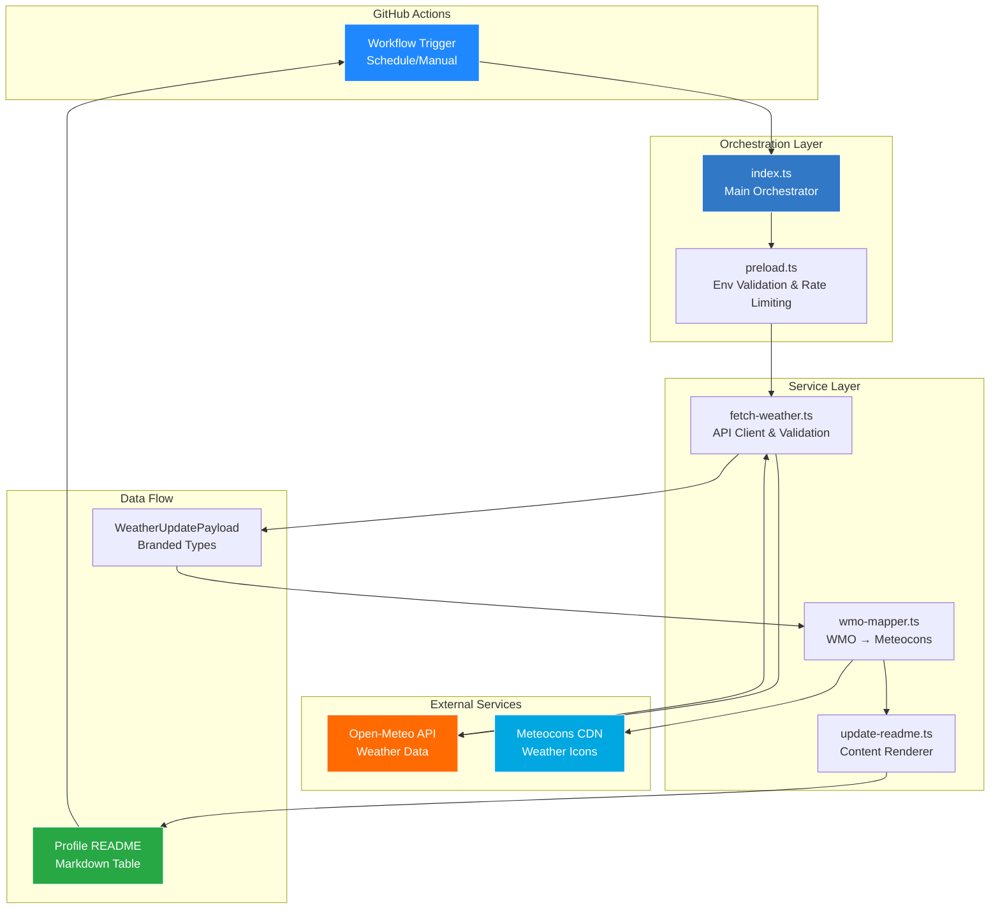
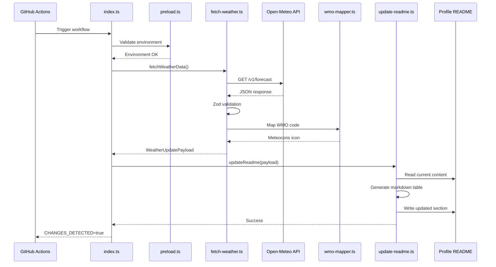

# Architecture

This document provides a detailed, implementation-level overview of Profile Weather View v2: modules, control flow, data shapes, workflows, and quality gates. The README offers a high-level tour; this file dives deep into the specifics.

## System Architecture



## Component Interaction Sequence



## Goals and constraints

- Fast, deterministic CI steps suitable for frequent schedules
- Minimal external surface area: one API provider (Open-Meteo), one README target
- Strict type safety and validation (TypeScript strict + Zod)
- 100% unit coverage on core modules, reproducible runs
- Clear logs and signals for GitHub Actions consumption
- No API key required: Open-Meteo provides free weather data

## Runtime & core libraries

- **Runtime**: Bun 1.3+ (fast startup, native fetch, file I/O, `Bun.env` for environment)
- **Language**: TypeScript 5.9+ (strict mode, `satisfies` operator, branded types)
- **Validation**: Zod 4 (named imports, schema-first validation)
- **Time**: Temporal polyfill (timezone-safe operations)
- **Icons**: Meteocons (animated weather icons via WMO codes)

## Source layout (ownership and responsibilities)

- `src/weather-update/index.ts`
  - Main orchestrator: validates env, fetches data, updates README, logs, and signals status
  - Provides `log()` with timestamped severity prefixes and `createErrorInfo()` for structured errors
  - Uses `Bun.env` for environment access (2026 Bun-native pattern)
  - Emits `CHANGES_DETECTED=true|false` to help workflows decide on committing
- `src/weather-update/services/fetch-weather.ts`
  - Builds Open-Meteo API request with `as const satisfies` typed configurations
  - Uses `measureTime()` utility for performance tracking
  - Validates JSON payload using Zod (named imports); converts timestamps via Temporal
  - Produces branded-type payload: `WeatherUpdatePayload`
- `src/weather-update/services/wmo-mapper.ts`
  - Maps WMO weather interpretation codes to Meteocons icon names
  - Provides day/night variants for accurate weather visualization
  - Generates Meteocons CDN URLs for weather icons
- `src/weather-update/services/update-readme.ts`
  - Detects the section bounded by `<!-- Hourly Weather Update --> ... <!-- End of Hourly Weather Update -->`
  - Supports both Markdown pipe-tables and HTML `<table>` formats (auto-detected)
  - Renders weather data with Meteocons icons; updates "Last refresh" timestamp
  - Writes only when content changes (or when `FORCE_UPDATE=true`)
- `src/weather-update/utils/preload.ts`
  - Validates and normalizes environment variables before the main flow executes
  - Tracks daily API call counts to respect rate limits

## Data contracts

Zod schemas define and validate the network payload, and a minimal view model powers rendering.

```ts
// View model used throughout the rendering pipeline
export interface WeatherUpdatePayload {
  readonly description: string;        // e.g., "Clear Sky"
  readonly temperatureC: TemperatureCelsius;  // branded type, rounded
  readonly sunriseLocal: TimeString;   // HH:mm in Asia/Dhaka
  readonly sunsetLocal: TimeString;    // HH:mm in Asia/Dhaka
  readonly humidityPct: HumidityPercentage;   // branded type, 0..100
  readonly icon: MeteoconIconName;     // Meteocons icon name (e.g., "clear-day")
}
```

Key Zod schemas (representative):

- `OpenMeteoResponseSchema`: validates Open-Meteo JSON structure including `current` and `daily` nodes
- `ProcessedWeatherSchema`: validates transformed internal data before payload creation

## Control flow

1) `index.ts` logs startup context (env, CI) and ensures env is valid
2) `fetchWeatherData()` constructs Open-Meteo URL with coordinates and required fields
   - Uses native fetch with configurable timeout
   - Validates JSON via Zod → transforms to `WeatherUpdatePayload`
   - Maps WMO weather code to Meteocons icon using `wmoToMeteocons()`
3) `updateReadme()`
   - Loads target README (`PROFILE_README_PATH` override supported)
   - Extracts existing section and generates updated markdown table
   - Includes Meteocons animated icon from CDN
   - Writes only if changed or `FORCE_UPDATE=true`
4) `index.ts` records duration and emits `CHANGES_DETECTED` for the workflow

## Error handling and logging

- `createErrorInfo()` produces structured error objects with timestamp and context
- `log()` uses `LOG_PREFIXES` map for emoji-prefixed severity levels (info/success/warning/error)
- On failure, the process exits non-zero (CI-visible) and includes actionable hints

## Configuration and environment

- No API key required: Open-Meteo is free for non-commercial use
- Optional: `FORCE_UPDATE=true`, `PROFILE_README_PATH`, `GITHUB_ACTIONS=true`
- Coordinates are defined at module scope and may be customized:
  - `LOCATION = { lat: 23.8759, lon: 90.3795, timezone: "Asia/Dhaka" }`

## Performance characteristics

- Only current weather + daily sunrise/sunset data is fetched to minimize payload
- Timeouts bound worst-case execution times
- Rendering is string-based; file writes occur only when needed
- Daily API call tracking prevents excessive requests

## CI/CD integration

- Profile Weather Update workflow
  - Schedules: morning/afternoon/evening (Asia/Dhaka) and manual dispatch
  - Bun + cache restore/save, quality steps, then the main script
  - Signed commit to the profile repo using PAT + GPG, including Dhaka-local timestamps in messages
- Semantic Release workflow
  - Runs on Node LTS; uses `GITHUB_TOKEN` (PAT not required)
  - Generates changelog/releases from Conventional Commits
- README Tech Stack Sync workflow
  - Triggers on `package.json`/`bun.lock` changes (e.g., Renovate)
  - Updates flat-square tech badges and footer date via a script; commits signed, with `[skip actions]`

## Quality gates and observability

- Tests: Bun test runner with 100% coverage; LCOV at `coverage/lcov.info` (used by SonarCloud)
- Lint/format: Ultracite (Biome) with project rules enforced
- Logs: grouped `::group::` blocks in workflows; step outputs include response timing and change flags

## Extensibility

- **Multi-location support**: parameterize `LOCATION` and render multiple rows
- **Pluggable providers**: implement a provider that returns `WeatherUpdatePayload`
- **Alternate icon sets**: swap Meteocons for another icon library in `wmo-mapper.ts`
- **i18n/timezones/units**: parameterize locale, timezone, and units for global audiences

## Security considerations

- No API secrets required for weather data (Open-Meteo is free)
- Input validation via Zod in preload and services
- Tests use mocks to avoid network access
- GPG signing for automated commits

## Failure modes and recovery

- Network failures: graceful error handling with descriptive messages
- Validation failures: show aggregated Zod messages with precise paths
- File I/O failures: safe failure (returns false) to avoid partial state; workflow summaries indicate status

## Appendix: module responsibilities

- `src/weather-update/index.ts`: orchestration, logging, errors, CI signaling
- `src/weather-update/services/fetch-weather.ts`: network, validation, transformation
- `src/weather-update/services/wmo-mapper.ts`: WMO code → Meteocons mapping
- `src/weather-update/services/update-readme.ts`: content detection, rendering, diff/write
- `src/weather-update/utils/preload.ts`: env validation, rate limiting, bootstrap
