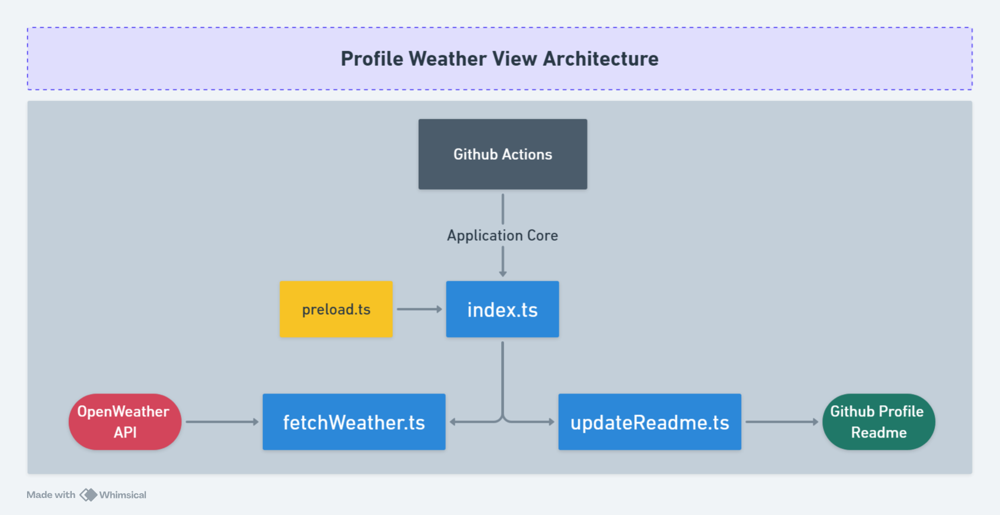

# Architecture

This document provides a detailed, implementation-level overview of Profile Weather View v2: modules, control flow, data shapes, workflows, and quality gates. The README offers a high-level tour; this file dives deep into the specifics.

## Diagram

<div align="center">
  
  <p><em>GitHub Actions orchestrates the app entrypoint, which validates env, fetches current weather, and updates a README section.</em></p>
</div>

## Goals and constraints

- Fast, deterministic CI steps suitable for frequent schedules
- Minimal external surface area: one API provider, one README target
- Strict type safety and validation (TypeScript strict + Zod)
- 100% unit coverage on core modules, reproducible runs
- Clear logs and signals for GitHub Actions consumption

## Runtime & core libraries

- **Runtime**: Bun 1.2+ (fast startup, native fetch, file I/O)
- **Language**: TypeScript 5.x (strict)
- **Validation**: Zod 4 (schema-first validation)
- **Time**: Temporal polyfill (timezone-safe operations)

## Source layout (ownership and responsibilities)

- `src/weather-update/index.ts`
  - Main orchestrator: validates env, fetches data, updates README, logs, and signals status
  - Provides `log()` with timestamped messages and `handleError()` for consistent error context
  - Emits `CHANGES_DETECTED=true|false` to help workflows decide on committing
- `src/weather-update/services/fetchWeather.ts`
  - Builds OpenWeather One Call 3.0 current weather request and performs resilient fetch
  - Validates JSON payload using Zod; converts timestamps to `Asia/Dhaka` with Temporal
  - Produces a small, stable view model used by the renderer: `WeatherUpdatePayload`
- `src/weather-update/services/updateReadme.ts`
  - Detects the section bounded by `<!-- Hourly Weather Update --> ... <!-- End of Hourly Weather Update -->`
  - Infers the existing markup style (table cells, block, or plain text) and renders accordingly
  - Updates the “Last refresh” line using Temporal; writes only when content changes (or when forced)
- `src/weather-update/utils/preload.ts`
  - Validates and normalizes environment variables before the main flow executes

## Data contracts

Zod schemas define and validate the network payload, and a minimal view model powers rendering.

```ts
// View model used throughout the rendering pipeline
export type WeatherUpdatePayload = {
  description: string;     // e.g., "Clear Sky"
  temperatureC: number;    // integer, rounded
  sunriseLocal: string;    // HH:mm in Asia/Dhaka
  sunsetLocal: string;     // HH:mm in Asia/Dhaka
  humidityPct: number;     // 0..100
  icon: string;            // OpenWeather icon code
};
```

Key Zod schemas (representative):

- `CurrentWeatherSchema`: validates fields such as `temp`, `humidity`, `sunrise`, `sunset`, and weather conditions
- `WeatherSchema`: wraps the `current` node and top-level metadata

## Control flow

1) `index.ts` logs startup context (env, CI) and ensures env is valid
2) `fetchWeatherData()` constructs URL with `lat`, `lon`, `appid`, `units=metric`, `exclude=minutely,hourly,daily,alerts`
   - Uses native fetch with `AbortSignal.timeout(8000)`
   - Retries with exponential backoff for non-4xx errors; fails fast on 4xx
   - Validates JSON via Zod → transforms to `WeatherUpdatePayload`
3) `updateReadme()`
   - Loads target README (`PROFILE_README_PATH` override supported)
   - Extracts existing section and matches render style
   - Generates updated markup + refresh time and diffs old vs new
   - Writes only if changed or `FORCE_UPDATE=true`
4) `index.ts` records duration and emits `CHANGES_DETECTED` for the workflow

## Error handling and logging

- `handleError()` standardizes error messages and provides timestamped context
- `log()` prefixes with ISO timestamps and emojis for CI readability
- On failure, the process exits non-zero (CI-visible) and includes actionable hints

## Configuration and environment

- Required: `OPEN_WEATHER_KEY`
- Optional: `FORCE_UPDATE=true`, `PROFILE_README_PATH`, `GITHUB_ACTIONS=true`
- Coordinates are defined at module scope and may be customized:
  - `LOCATION = { lat: '23.8759', lon: '90.3795' }`

## Performance characteristics

- Only current weather data is fetched to minimize payload and latency
- Timeouts and low retry counts bound worst-case execution times
- Rendering is string-based; file writes occur only when needed

## CI/CD integration

- Profile Weather Update workflow
  - Schedules: morning/afternoon/evening (Asia/Dhaka) and manual dispatch
  - Bun + cache restore/save, quality steps, then the main script
  - Signed commit to the profile repo using PAT + GPG, including Dhaka-local timestamps in messages
- Semantic Release workflow
  - Runs on Node LTS; uses `GITHUB_TOKEN` (PAT not required)
  - Generates changelog/releases from Conventional Commits
- README Tech Stack Sync workflow
  - Triggers on `package.json`/`bun.lock` changes (e.g., Renovate)
  - Updates flat-square tech badges and footer date via a script; commits signed, with `[skip actions]`

## Quality gates and observability

- Tests: Bun test runner with coverage; LCOV at `coverage/lcov.info` (used by SonarCloud)
- Lint/format: Ultracite (Biome) with project rules enforced
- Logs: grouped `::group::` blocks in workflows; step outputs include response timing and change flags

## Extensibility

- **Multi-location support**: parameterize `LOCATION` and render multiple rows
- **Pluggable providers**: implement a provider that returns `WeatherUpdatePayload`
- **Alternate renderers**: add additional formats in `createWeatherData()`
- **i18n/timezones/units**: parameterize locale, timezone, and units for global audiences

## Security considerations

- Never commit secrets; load from GitHub Secrets in Actions
- Input validation via Zod in preload and services
- Tests use mocks to avoid network access; avoids leaking tokens

## Failure modes and recovery

- Network failures: retried unless 4xx, with exponential backoff
- Validation failures: show aggregated Zod messages with precise paths
- File I/O failures: safe failure (returns false) to avoid partial state; workflow summaries indicate status

## Appendix: module responsibilities

- `src/weather-update/index.ts`: orchestration, logging, errors, CI signaling
- `src/weather-update/services/fetchWeather.ts`: network, validation, transformation
- `src/weather-update/services/updateReadme.ts`: content detection, rendering, diff/write
- `src/weather-update/utils/preload.ts`: env validation and bootstrap
