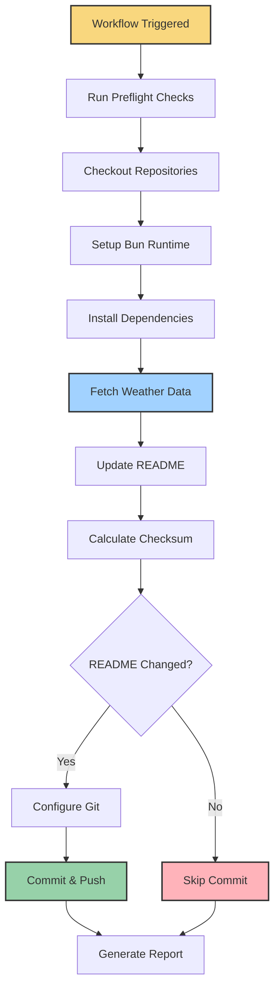

# Deployment

<br>

<div align="center" style="display: flex; justify-content: center; gap: 5px; flex-wrap: wrap;">
  
  
  
  
</div>

## Table of Contents

- [Overview](#overview)
- [GitHub Actions Deployment](#github-actions-deployment)
  - [Workflow Architecture](#workflow-architecture)
  - [Workflow Configuration](#workflow-configuration)
  - [Execution Strategy](#execution-strategy)
  - [Security and Authentication](#security-and-authentication)
  - [Artifact Management](#artifact-management)
- [Manual Deployment](#manual-deployment)
  - [Local Environment Setup](#local-environment-setup)
  - [Execution Process](#execution-process)
  - [Debugging](#debugging)
- [Monitoring and Maintenance](#monitoring-and-maintenance)
- [Troubleshooting](#troubleshooting)

## Overview

Profile Weather View uses a serverless deployment model via GitHub Actions, eliminating the need for dedicated infrastructure while leveraging GitHub's CI/CD capabilities. The application runs on a scheduled basis to keep GitHub profile weather information up-to-date, with options for both automated and manual execution.

## GitHub Actions Deployment

### Workflow Architecture

The application is deployed as a GitHub Actions workflow with the following characteristics:

- **Serverless Execution**: Runs directly in GitHub's cloud infrastructure
- **No Dedicated Infrastructure**: No servers to maintain
- **Cost-Effective**: Uses GitHub's free tier for open-source projects
- **Automated Scheduling**: Maintains up-to-date weather information

<div align="center">
  
</div>

### Workflow Configuration

The workflow is defined in `.github/workflows/update-readme.yml`:

```yaml
name: Profile README Weather Update

# Trigger mechanisms for workflow execution
on:
  schedule:
    # Runs at 17 minutes past every 6th hour (avoiding peak traffic times)
    - cron: '17 */6 * * *'
  workflow_dispatch: # Allows manual triggering with parameters
    inputs:
      location:
        description: 'Weather location to display'
        required: false
        default: 'Dhaka'
        type: string
      force_update:
        description: 'Force README update even if weather unchanged'
        required: false
        default: false
        type: boolean
      debug:
        description: 'Enable verbose debug logging'
        required: false
        default: false
        type: boolean

jobs:
  preflight:
    name: Preflight Checks
    runs-on: ubuntu-latest
    # Job steps...

  update-weather:
    name: Update Profile README Weather
    needs: preflight
    runs-on: ubuntu-latest
    # Job steps...
```

#### Trigger Mechanisms

The workflow can be initiated in two ways:

1. **Scheduled Execution**

   - Runs automatically every 6 hours
   - Uses cron syntax: `17 */6 * * *`
   - Translates to: "At minute 17, every 6th hour, every day"
   - Example times: 00:17, 06:17, 12:17, 18:17 UTC

2. **Manual Execution**
   - Triggered via GitHub's UI using the `workflow_dispatch` event
   - Accessible through the "Actions" tab in the repository
   - Supports customizable parameters:
     - Weather location
     - Force update option
     - Debug logging toggle

### Execution Strategy

The workflow is organized into two main jobs:

1. **Preflight Checks**

   - Verifies the execution environment
   - Checks for required secrets
   - Tests the OpenWeather API availability

2. **Update Weather**
   - Main job for updating the README with weather data
   - Runs only if preflight checks succeed

The update weather job follows this process:

| Step                  | Description                                                  |
| --------------------- | ------------------------------------------------------------ |
| Repository Setup      | Checks out both the weather script and personal repositories |
| Environment Setup     | Sets up the Bun runtime and configures the environment       |
| Dependency Management | Installs and caches required packages                        |
| Data Acquisition      | Fetches weather data with retry logic                        |
| README Management     | Updates the README.md with new weather data                  |
| Version Control       | Commits and pushes changes if the README was updated         |
| Reporting             | Generates an execution summary                               |

#### Process Flow



### Security and Authentication

The workflow employs several security practices:

1. **Permission Scoping**

   - Uses minimal required permissions for the workflow
   - Restricts access to only necessary resources

   ```yaml
   permissions:
     contents: write # For README updates
     id-token: write # For OIDC authentication
     security-events: write # For security scanning
   ```

2. **Commit Signing**

   - All commits are cryptographically signed
   - Uses GitHub's built-in signing capabilities
   - Provides verification that commits came from the workflow

   ```yaml
   - name: 'Configure Git for Secure Operations'
     run: |
       git config user.name "github-actions[bot]"
       git config user.email "41898282+github-actions[bot]@users.noreply.github.com"

       git config commit.gpgsign true
       git config gpg.format ssh
       git config user.signingkey "${{ github.token }}"
   ```

3. **Secrets Management**
   - API keys stored as GitHub secrets
   - Secrets verified during preflight checks
   - Not exposed in logs or outputs

### Backup and Recovery

The workflow includes backup and recovery mechanisms:

1. **README Backups**

   - Creates a backup of the README before modification
   - Allows rollback in case of update failures

   ```yaml
   # Create backup for safety and rollback capability
   cp tashfiqul-islam/README.md tashfiqul-islam/README.md.bak
   ```

2. **Error Handling**
   - Contains appropriate error handling throughout
   - Restores from backup on failure
   - Detailed error logging for troubleshooting

## Manual Deployment

The application can also be run manually in a local environment for development, testing, or one-off updates.

### Local Environment Setup

1. **Clone the Repository**

   ```bash
   git clone https://github.com/yourusername/profile-weather-view.git
   cd profile-weather-view
   ```

2. **Install Dependencies**

   ```bash
   bun install
   ```

3. **Configure Environment Variables**
   - Create a `.env` file in the project root:
   ```
   OPEN_WEATHER_KEY=your_api_key_here
   ```

### Execution Process

1. **Run the Application**

   ```bash
   bun start
   ```

2. **What Happens**

   - Bun builds the TypeScript code
   - The application loads environment variables
   - Weather data is fetched from OpenWeather API
   - The README.md file in your current directory is updated

3. **Development Mode**
   For faster iteration during development:
   ```bash
   bun run dev
   ```

### Debugging

For troubleshooting local deployment issues:

1. **Check API Key**

   - Verify your OpenWeather API key is valid
   - Ensure it's correctly set in the `.env` file

2. **Monitor Network Requests**

   - The application logs API request information
   - Check for any error messages related to API calls

3. **Examine Console Output**
   - Weather data fetching logs
   - README update status
   - Any error messages

## Monitoring and Maintenance

### Workflow Monitoring

1. **GitHub Actions Dashboard**

   - View workflow runs: Repository → Actions tab
   - Check run status, logs, and execution history
   - Filter by workflow name or status

2. **Execution Summary**
   - Each workflow run generates a detailed summary
   - Includes execution time, weather data, and status
   - Available in the workflow run logs

### Maintenance Tasks

1. **API Key Rotation**

   - Periodically update your OpenWeather API key
   - Update the repository secrets in GitHub

2. **Dependency Updates**

   - Regularly update dependencies using `bun update`
   - Consider enabling Dependabot for automated updates

3. **Workflow Updates**
   - Review and update workflow configuration as needed
   - Test changes by triggering manual workflow runs

## Troubleshooting

### Common Issues

1. **Workflow Failures**

   - **API Rate Limiting**: Check if you've exceeded OpenWeather API limits
   - **Authentication Issues**: Verify GitHub token permissions
   - **Network Problems**: Temporary API outages or connectivity issues

2. **README Not Updating**
   - **No Weather Changes**: The workflow only commits when data changes
   - **Repository Path Issues**: Verify repository paths in the workflow
   - **Permissions Problems**: Check if the workflow has write permissions

### Resolution Steps

1. **View Detailed Logs**

   - Check the specific job that failed
   - Examine the error messages
   - Look for any environment or configuration issues

2. **Run Manually with Debug Mode**

   - Trigger the workflow manually with debug mode enabled
   - Use the workflow_dispatch event in the Actions tab
   - Set the debug parameter to true

3. **Check API Status**
   - The preflight checks verify API health
   - View the preflight job output for API status
   - Consider temporary API issues if status is degraded

---

<div align="center">
  <p>
    <strong>Profile Weather View</strong> | Deployment Documentation
  </p>
  <p>
    <small>Last updated: March 2025</small>
  </p>
</div>
