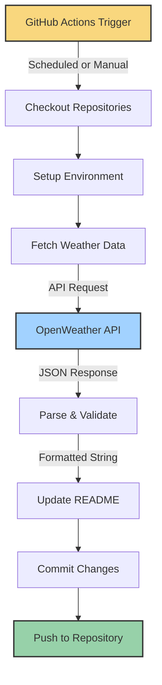

# Architecture

<div align="center">
  
  
  
</div>

## Overview

Profile Weather View follows a service-oriented architecture pattern designed for simplicity, maintainability, and automation. The application is structured to run both as a scheduled task via GitHub Actions and as a local development tool.

## Project Structure

```
profile-weather-view/
├── .github/
│   └── workflows/               # GitHub Actions automation
│       └── update-readme.yml    # Scheduled weather update workflow
├── .husky/                      # Git hooks for code quality
│   ├── commit-msg               # Commit message validation
│   └── pre-commit               # Pre-commit checks
├── src/
│   ├── __tests__/               # Comprehensive test suite
│   │   ├── index.test.ts        # Main application tests
│   │   ├── services/            # Service-specific tests
│   │   └── utils/               # Utility tests
│   ├── config/                  # Configuration modules
│   │   ├── comments.config.mjs  # ESLint comments configuration
│   │   ├── parser.config.mjs    # TypeScript parser settings
│   │   ├── security.config.mjs  # Security rules
│   │   └── ...                  # Other config modules
│   ├── docs/                    # Documentation files
│   ├── services/                # Core business logic
│   │   ├── fetchWeather.ts      # Weather API interaction
│   │   └── updateReadme.ts      # README file manipulation
│   ├── utils/                   # Shared utilities
│   │   └── preload.ts           # Environment validation
│   └── index.ts                 # Application entry point
├── .env                         # Environment variables (gitignored)
├── bunfig.toml                  # Bun runtime configuration
├── eslint.config.mjs            # ESLint configuration
├── prettier.config.mjs          # Code formatting rules
├── tsconfig.json                # TypeScript compilation settings
├── commitlint.config.cjs        # Commit message validation
└── vitest.config.ts             # Test runner configuration
```

## Core Components

The application is organized into distinct components, each with a single responsibility:

### Entry Point

**`index.ts`** - The main application orchestrator that:

- Initializes the application
- Coordinates between services
- Handles top-level error management
- Provides a clean execution flow

### Services Layer

The services layer encapsulates the core business logic of the application:

#### `fetchWeather.ts`

**Purpose**: Manages all interactions with the OpenWeather API.

**Responsibilities**:

- Constructing API requests with proper parameters
- Validating API responses using Zod schema
- Converting UTC timestamps to local time
- Formatting weather data for downstream use
- Handling network and validation errors

**Key Functions**:

- `fetchWeatherData()`: Makes API calls and processes responses
- `convertToDhakaTime()`: Timezone conversion utility

#### `updateReadme.ts`

**Purpose**: Manages README file operations.

**Responsibilities**:

- Reading the current README content
- Parsing weather data components
- Generating HTML-formatted weather section
- Replacing content via regex pattern matching
- Writing updated content back to disk
- Timestamping updates

**Key Functions**:

- `updateReadme()`: Performs the README update operation

### Utilities Layer

Provides shared functionality used across the application:

#### `preload.ts`

**Purpose**: Environment preparation and validation.

**Responsibilities**:

- Loading environment variables from .env file
- Validating required variables presence
- Providing early failure for missing configurations
- Enabling type-safe environment variable access

**Key Functions**:

- `ensureEnvironmentVariables()`: Validates configuration

### Configuration Layer

Houses modular configuration files for various tools:

- **ESLint Configurations**: Code quality rules
- **TypeScript Configuration**: Type checking settings
- **Test Configuration**: Test runner settings
- **Commit Lint Rules**: Commit message standardization

## Data Flow

The application follows a unidirectional data flow pattern:



### Execution Flow

1. **Trigger**: GitHub Actions workflow activates either:

   - On schedule (every 8 hours via cron)
   - Manually through workflow_dispatch

2. **Repository Setup**:

   - Checkout the weather script repository
   - Checkout the target personal repository
   - Setup authentication for Git operations

3. **Environment Preparation**:

   - Setup Bun runtime
   - Install dependencies
   - Validate environment variables

4. **Data Retrieval**:

   - Fetch current weather data for configured location
   - Parse and validate API response
   - Format data for README integration

5. **Content Update**:

   - Read current README content
   - Replace weather section with updated data
   - Add timestamp for last refresh

6. **Publication**:
   - Commit changes if README was modified
   - Push changes to the repository
   - Skip commit if no changes detected

## Architecture Decisions

### Technology Selection

- **Bun**: Chosen for its speed and modern JavaScript runtime capabilities
- **TypeScript**: Provides type safety and improved developer experience
- **Zod**: Ensures runtime validation of external API responses
- **Vitest**: Modern, ESM-compatible testing framework
- **GitHub Actions**: Enables seamless automation without external dependencies

### Design Patterns

- **Service-Oriented Design**: Separates concerns into focused service modules
- **Configuration-as-Code**: Externalizes all configuration for flexibility
- **Dependency Injection**: Simplifies testing through mock substitution
- **Error Normalization**: Standardizes error handling across the application

### Quality Assurance

- **Pre-commit Hooks**: Enforce code quality before changes are committed
- **Conventional Commits**: Standardize commit messages for better history
- **Comprehensive Testing**: Ensures reliability through high test coverage
- **Type Safety**: Prevents common runtime errors through static analysis

## Deployment Architecture

The application is primarily deployed as a GitHub Actions workflow, running directly in GitHub's cloud infrastructure:

```
┌─────────────────────────────┐
│   GitHub Actions Runner     │
│                             │
│  ┌─────────────────────┐    │
│  │  Profile Weather    │    │
│  │  View Application   │    │
│  └─────────────────────┘    │
│           │                 │
└───────────┼─────────────────┘
            ▼
┌─────────────────────────────┐
│    OpenWeather API          │
└─────────────────────────────┘
            │
            ▼
┌─────────────────────────────┐
│    GitHub Repository        │
│  ┌─────────────────────┐    │
│  │    README.md        │◄───┘
│  └─────────────────────┘    │
└─────────────────────────────┘
```

This serverless approach eliminates the need for dedicated infrastructure while leveraging GitHub's robust CI/CD capabilities.

---

<div align="center">
  <p>
    <strong>Profile Weather View</strong> | Modern TypeScript Architecture
  </p>
</div>
