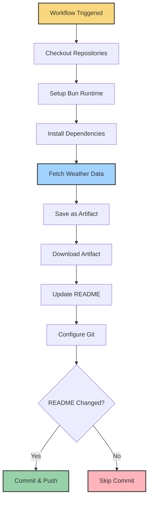

# Deployment

<div align="center">
  
  
  
  
</div>

## Table of Contents

- [Overview](#overview)
- [GitHub Actions Deployment](#github-actions-deployment)
  - [Workflow Architecture](#workflow-architecture)
  - [Workflow Configuration](#workflow-configuration)
  - [Execution Strategy](#execution-strategy)
  - [Security and Authentication](#security-and-authentication)
  - [Artifact Management](#artifact-management)
- [Manual Deployment](#manual-deployment)
  - [Local Environment Setup](#local-environment-setup)
  - [Execution Process](#execution-process)
  - [Debugging](#debugging)
- [Monitoring and Maintenance](#monitoring-and-maintenance)
- [Troubleshooting](#troubleshooting)

## Overview

Profile Weather View uses a serverless deployment model via GitHub Actions, eliminating the need for dedicated infrastructure while leveraging GitHub's robust CI/CD capabilities. The application runs on a scheduled basis to keep GitHub profile weather information up-to-date, with options for both automated and manual execution.

## GitHub Actions Deployment

### Workflow Architecture

The application is deployed as a GitHub Actions workflow with the following characteristics:

- **Serverless Execution**: Runs directly in GitHub's cloud infrastructure
- **Zero Infrastructure**: No dedicated servers to maintain
- **Cost-Effective**: Uses GitHub's free tier for open-source projects
- **Highly Available**: Backed by GitHub's reliable infrastructure
- **Automated Scheduling**: Maintains up-to-date weather information

<div align="center">
  
</div>

### Workflow Configuration

The workflow is defined in `.github/workflows/update-readme.yml`:

```yaml
name: Readme Weather Update

# 🚀 Trigger Mechanisms for GitHub Actions
on:
  schedule:
    - cron: '0 */8 * * *' # Runs automatically every 8 hours
  workflow_dispatch: # Allows manual triggering

jobs:
  update-readme-weather:
    runs-on: ubuntu-latest

    # 🏎️ Strategy matrix to parallelize tasks
    strategy:
      matrix:
        task:
          [
            checkout-repos,
            setup-bun,
            install-deps,
            fetch-weather,
            update-readme,
            commit-push,
          ]

    steps:
      # Steps for each task...
```

#### Trigger Mechanisms

The workflow can be initiated in two ways:

1. **Scheduled Execution**

   - Runs automatically every 8 hours
   - Uses cron syntax: `0 */8 * * *`
   - Translates to: "At minute 0, every 8th hour, every day"
   - Example times: 00:00, 08:00, 16:00 UTC

2. **Manual Execution**
   - Triggered via GitHub's UI using the `workflow_dispatch` event
   - Accessible through the "Actions" tab in the repository
   - Useful for testing or forcing an update outside the schedule

### Execution Strategy

The workflow uses a matrix strategy to organize tasks conceptually, though they execute sequentially due to dependencies:

| Task             | Description                                                  | Dependencies     |
| ---------------- | ------------------------------------------------------------ | ---------------- |
| `checkout-repos` | Checks out both the weather script and personal repositories | None             |
| `setup-bun`      | Sets up the Bun runtime environment                          | `checkout-repos` |
| `install-deps`   | Installs project dependencies                                | `setup-bun`      |
| `fetch-weather`  | Fetches current weather data from OpenWeather API            | `install-deps`   |
| `update-readme`  | Updates the README.md with new weather data                  | `fetch-weather`  |
| `commit-push`    | Commits and pushes changes if README was updated             | `update-readme`  |

#### Detailed Process Flow



### Security and Authentication

The workflow employs several security best practices:

1. **OIDC Authentication**

   - Uses GitHub's OpenID Connect for secure authentication
   - Eliminates the need for long-lived access tokens
   - Provides just-in-time token issuance

   ```yaml
   - name: Authenticate GitHub with OIDC
     if: matrix.task == 'checkout-repos'
     run: gh auth setup-git
     env:
       GH_TOKEN: ${{ secrets.GITHUB_TOKEN }}
   ```

2. **Commit Signing**

   - All commits are cryptographically signed
   - Uses GitHub's built-in GPG capabilities
   - Provides verification that commits came from the workflow

   ```yaml
   - name: Configure Git for Signing
     if: matrix.task == 'commit-push'
     run: |
       git config --global user.email "41898282+github-actions[bot]@users.noreply.github.com"
       git config --global user.name "github-actions[bot]"
       git config --global commit.gpgsign true
       git config --global gpg.format ssh
       git config --global user.signingkey ${{ secrets.GITHUB_TOKEN }}
   ```

3. **Least Privilege**
   - The workflow only accesses repositories it needs
   - Repository paths are explicitly defined
   - Token permissions are limited to required operations

### Artifact Management

Artifacts are used to pass data between workflow steps:

1. **Weather Data Artifact**

   - Created after fetching weather data
   - Contains formatted weather information
   - Persists throughout the workflow run
   - Downloaded by the README update step

   ```yaml
   - name: Upload Weather Data
     if: matrix.task == 'fetch-weather'
     uses: actions/upload-artifact@v4
     with:
       name: weather-data
       path: ./git-profile-weather-view/weather.json
   ```

2. **Artifact Lifecycle**
   - Created when weather data is fetched
   - Available to all subsequent jobs
   - Automatically cleaned up after workflow completion (default retention: 90 days)

## Manual Deployment

The application can also be run manually in a local environment for development, testing, or one-off updates.

### Local Environment Setup

1. **Clone the Repository**

   ```bash
   git clone https://github.com/yourusername/profile-weather-view.git
   cd profile-weather-view
   ```

2. **Install Dependencies**

   ```bash
   bun install
   ```

3. **Configure Environment Variables**
   - Create a `.env` file in the project root:
   ```
   OPEN_WEATHER_KEY=your_api_key_here
   ```

### Execution Process

1. **Run the Application**

   ```bash
   bun start
   ```

2. **What Happens**

   - Bun builds the TypeScript code
   - The application loads environment variables
   - Weather data is fetched from OpenWeather API
   - The README.md file in your current directory is updated

3. **Development Mode**
   For faster iteration during development:
   ```bash
   bun run dev
   ```

### Debugging

For troubleshooting local deployment issues:

1. **Check API Key**

   - Verify your OpenWeather API key is valid
   - Ensure it's correctly set in the `.env` file

2. **Monitor Network Requests**

   - The application logs API request information
   - Check for any error messages related to API calls

3. **Examine Console Output**
   - Weather data fetching logs
   - README update status
   - Any error messages

## Monitoring and Maintenance

### Workflow Monitoring

1. **GitHub Actions Dashboard**

   - View workflow runs: Repository → Actions tab
   - Check run status, logs, and execution history
   - Filter by workflow name or status

2. **Notifications**
   - GitHub can send notifications for workflow failures
   - Configure in repository settings → Notifications

### Maintenance Tasks

1. **API Key Rotation**

   - Periodically update your OpenWeather API key
   - Update the repository secrets in GitHub

2. **Dependency Updates**

   - Regularly update dependencies using `bun update`
   - Consider enabling Dependabot for automated updates

3. **GitHub Actions Runner Updates**
   - GitHub maintains the runner environment
   - No manual updates required

## Troubleshooting

### Common Issues

1. **Workflow Failures**

   - **API Rate Limiting**: Check if you've exceeded OpenWeather API limits
   - **Authentication Issues**: Verify GitHub token permissions
   - **Network Problems**: Temporary API outages or connectivity issues

2. **README Not Updating**
   - **No Weather Changes**: The workflow only commits when data changes
   - **Repository Path Issues**: Verify repository paths in the workflow
   - **Permissions Problems**: Check if the workflow has write permissions

### Resolution Steps

1. **View Detailed Logs**

   - Check the specific job that failed
   - Examine the error messages
   - Look for any environment or configuration issues

2. **Run Manually**

   - Trigger the workflow manually to test fixes
   - Use the workflow_dispatch event in the Actions tab

3. **Inspect Artifacts**
   - Download and inspect artifacts from the failed run
   - Check if weather data was fetched correctly

---

<div align="center">
  <p>
    <strong>Profile Weather View</strong> | Deployment Documentation
  </p>
  <p>
    <small>Last updated: March 2025</small>
  </p>
</div>
