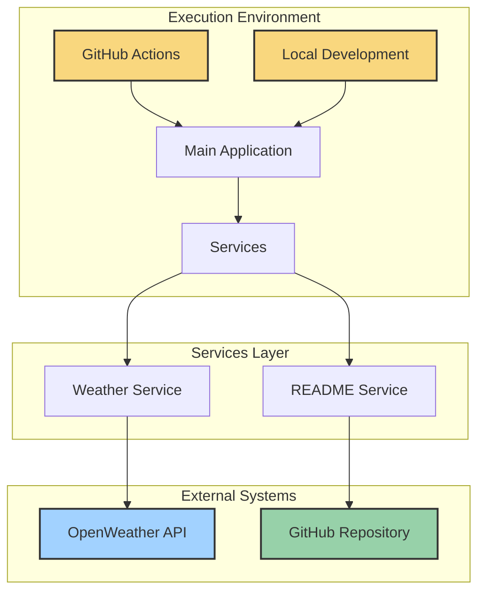
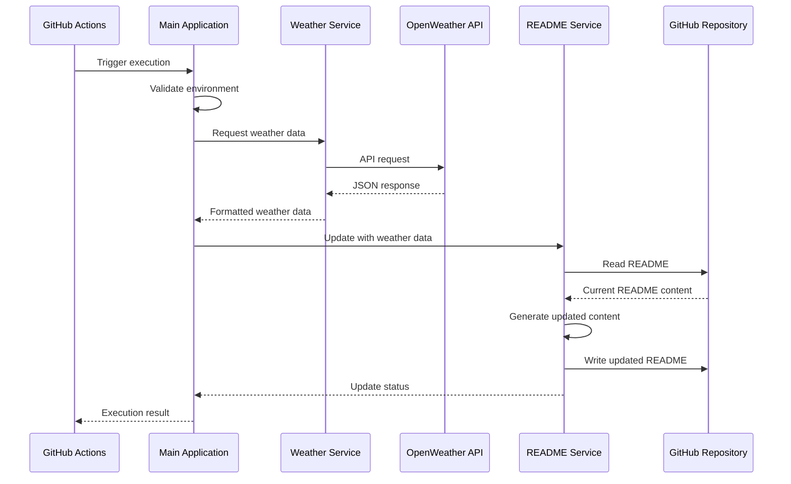
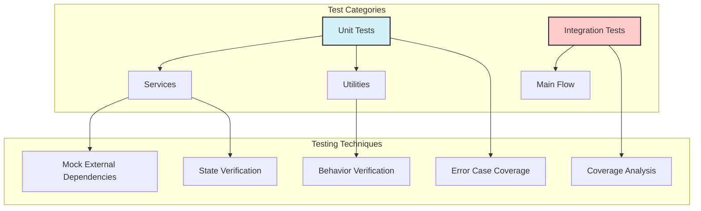
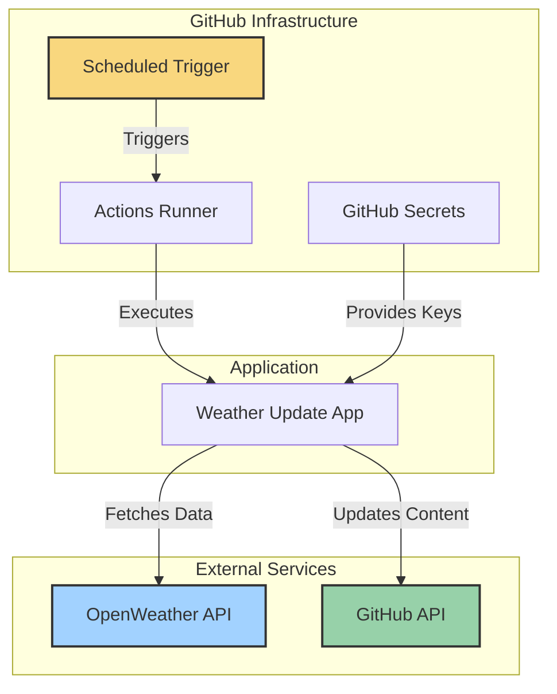

# Architecture

<div class="architecture-header">
  <div class="badges">
    <Badge type="info" text="Modern Architecture"></Badge>
    <Badge type="tip" text="Service Oriented"></Badge>
    <Badge type="warning" text="GitHub Actions"></Badge>
  </div>
</div>

## Overview

Profile Weather View uses a service-oriented architecture designed with simplicity,
maintainability, and automation at its core.
This architecture enables the application
to function both as a scheduled GitHub Actions workflow and as a local development tool,
ensuring consistent behavior across environments.

## Architectural Principles

The application follows these key architectural principles:

- **Separation of Concerns**: Each component has a single, well-defined responsibility
- **Fail-Fast Validation**: Early detection of configuration issues prevents cascading failures
- **Defensive Programming**: Comprehensive error handling at every layer
- **Type Safety**: Strong typing throughout the application lifecycle
- **Testing First**: High test coverage with isolated component testing

## System Architecture

### High-Level Overview



### Project Structure

```
profile-weather-view/
├── .github/
│   ├── dependabot.yml                     # Dependabot configuration
│   └── workflows/                         # GitHub Actions automation
│       ├── profile-weather-update.yml     # Scheduled weather update workflow
│       ├── dependabot-approve.yml         # Dependabot auto-approve workflow
│       └── dependabot-automerge.yml       # Dependabot auto-merge workflow
├── .husky/                                # Git hooks for code quality
│   ├── commit-msg                         # Commit message validation
│   └── pre-commit                         # Pre-commit checks
├── src/
│   ├── __tests__/                         # Comprehensive test suite
│   │   ├── setup.ts                       # Test setup & configuration
│   │   └── unit/                          # Unit test directory
│   │       ├── index.test.ts              # Main application tests
│   │       ├── services/                  # Service tests
│   │       │   ├── fetchWeather.test.ts   # Weather service tests
│   │       │   └── updateReadme.test.ts   # README service tests
│   │       └── utils/                     # Utility tests
│   │           └── preload.test.ts        # Environment utility tests
│   ├── config/                            # Configuration modules
│   │   ├── comments.config.mjs            # ESLint comments configuration
│   │   ├── parser.config.mjs              # TypeScript parser settings
│   │   ├── security.config.mjs            # Security rules
│   │   └── ...                            # Other config modules
│   ├── docs/                              # Documentation files
│   ├── weather-update/                    # Core business logic
│   │   ├── services/                      # Service layer
│   │   │   ├── fetchWeather.ts            # Weather API interaction
│   │   │   └── updateReadme.ts            # README file manipulation
│   │   ├── utils/                         # Shared utilities
│   │   │   └── preload.ts                 # Environment validation
│   │   └── index.ts                       # Application entry point
├── .env                                   # Environment variables (gitignored)
├── bunfig.toml                            # Bun runtime configuration
├── package.json                           # Project dependencies and scripts
├── eslint.config.mjs                      # ESLint configuration
├── prettier.config.mjs                    # Code formatting rules
├── tsconfig.json                          # TypeScript compilation settings
├── tsconfig.test.json                     # Test-specific TypeScript settings
├── commitlint.config.mjs                  # Commit message validation
└── vitest.config.ts                       # Test runner configuration
```

## Core Components

### Entry Point (`index.ts`)

The main orchestrator that coordinates the application flow:

- Initializes the environment and validates configuration
- Orchestrates the service interactions
- Implements top-level error handling and reporting
- Provides exit status codes for CI/CD integration

::: details Source Code Example

```typescript
export async function main(): Promise<void> {
  try {
    // Ensure required environment variables are present
    ensureEnvironmentVariables();

    console.warn('🌍 Starting weather update process...');

    // Fetch current weather data
    const weatherData = await fetchWeatherData();
    console.warn('✅ Weather data fetched successfully:', weatherData);

    // Check for a custom README path from environment variable
    const customReadmePath = process.env['PROFILE_README_PATH'];
    if (customReadmePath) {
      console.warn(`📝 Using custom README path: ${customReadmePath}`);
    }

    // Update the README with the new weather data
    const updateSuccess = await updateReadme(weatherData, customReadmePath);

    // Report update status and log appropriate message
    console.warn(
      updateSuccess
        ? '✅ README updated successfully with new weather data.'
        : '⚠️ No changes were made to the README.',
    );

    // Report status for GitHub Actions
    reportUpdateStatus(updateSuccess);

    console.warn('🎉 Weather update process completed successfully.');
  } catch (error: unknown) {
    handleError(error);
    process.exit(1); // Ensure process.exit(1) is called on error
  }
}
```

:::

### Services Layer

The service layer encapsulates the core business logic with clear boundaries of responsibility.

#### Weather Service (`fetchWeather.ts`)

**Responsibility**: Handles all interaction with the OpenWeather API.

**Key Functions**:

- `fetchWeatherData()`: Retrieves and processes weather data
- `convertToDhakaTime()`: Converts UTC timestamps to local time

**Design Patterns**:

- Data Validation with Zod Schema
- Temporal API for timezone handling
- Error normalization

::: details Implementation Details

- **API Integration**: Uses native fetch API with proper error handling
- **Data Validation**: Implements Zod schema to validate API responses
- **Data Transformation**: Processes raw data into a standardized format
- **Error Handling**: Normalizes different error types into consistent error messages
  :::

#### README Service (`updateReadme.ts`)

**Responsibility**: Manages all README file operations.

**Key Functions**:

- `updateReadme()`: Updates the README with new weather data

**Design Patterns**:

- Regex-based content replacement
- Idempotent operations (safe to run multiple times)
- File I/O with error handling

::: details Implementation Details

- **Content Detection**: Uses regex to locate the weather section in README
- **Format Preservation**: Maintains existing README formatting
- **Conditional Updates**: Only updates when content has changed
- **Last Updated Timestamp**: Adds formatted timestamp for tracking
  :::

### Utilities Layer

#### Environment Utility (`preload.ts`)

**Responsibility**: Ensures the application environment is properly configured.

**Key Functions**:

- `ensureEnvironmentVariables()`: Validates required environment variables

**Design Patterns**:

- Fail-fast validation
- Early error detection

## Data Flow

The application follows a linear data flow pattern:



## Configuration Architecture

The application uses a layered configuration approach:

1. **Runtime Configuration**: Environment variables for sensitive or environment-specific settings
2. **Build Configuration**: TypeScript and build tool settings
3. **Quality Configuration**: ESLint, Prettier, and other code quality tools
4. **CI/CD Configuration**: GitHub Actions workflow definitions

## Testing Architecture

The testing strategy follows a comprehensive approach:



### Testing Approach

- **Unit Testing**: Individual components tested in isolation
- **Integration Testing**: Testing component interactions
- **Mock Strategy**: External dependencies (API, filesystem) are mocked with Vitest
- **Coverage Requirements**: 100% coverage for all metrics
- **Test Environment**: Vitest with Node environment

### Test Directory Structure

The tests directory follows a hierarchical structure that mirrors the source code:

```
src/__tests__/
├── setup.ts                           # Test environment configuration
└── unit/
    ├── index.test.ts                  # Tests for the main entry point
    ├── services/
    │   ├── fetchWeather.test.ts       # Tests for weather service
    │   └── updateReadme.test.ts       # Tests for README service
    └── utils/
        └── preload.test.ts            # Tests for environment utilities
```

## Deployment Architecture

The application is deployed as a GitHub Actions workflow, functioning as a serverless solution:



### Deployment Features

- **Scheduled Execution**: Runs automatically on a defined schedule (three times daily)
- **Manual Triggering**: Allows on-demand execution with configurable parameters
- **Self-healing**: Implements retry mechanisms with exponential backoff for transient failures
- **Concurrency Control**: Prevents overlapping executions with resource locking
- **Dependency Caching**: Improves performance through intelligent caching
- **Selective Commits**: Only creates commits when actual changes are detected
- **Pipeline Stages**: Preflight checks, execution, verification, and recovery

## Security Architecture

Security is built into the architecture:

- **Secret Management**: API keys stored as GitHub Secrets
- **Principle of The Least Privilege**: Minimal permissions in GitHub Actions workflows
- **Input Validation**: All external data validated through Zod schemas
- **Dependency Management**: Automated updates via Dependabot with security patching
- **Code Scanning**: ESLint security plugin integration
- **Environment Isolation**: Clear separation between test and production environments

## Performance Considerations

The application is optimized for efficiency:

- **Minimal API Calls**: Only requests necessary weather data parts
- **Conditional Updates**: Only write to files when content changes
- **Optimized Runtime**: Fast Bun runtime with TypeScript
- **Efficient Dependency Management**: Frozen lockfiles and dependency caching
- **Strategic Scheduling**: Times chosen to balance freshness with resource usage
- **Resource Constraints**: Defined timeout periods and resource limits

## Future Architecture Extensions

The architecture is designed to accommodate future enhancements:

- **Multiple Weather Providers**: Service abstraction allows provider switching
- **Enhanced Visualization**: Data structure supports richer visualizations
- **Multiprofile Support**: Design allows for updating multiple profiles
- **Metrics Collection**: Architecture supports adding telemetry
- **Observability Enhancements**: Structure allows for monitoring integration

<style>
.architecture-header {
  display: flex;
  justify-content: center;
  margin-bottom: 2rem;
}

.badges {
  display: flex;
  gap: 0.5rem;
}
</style>
